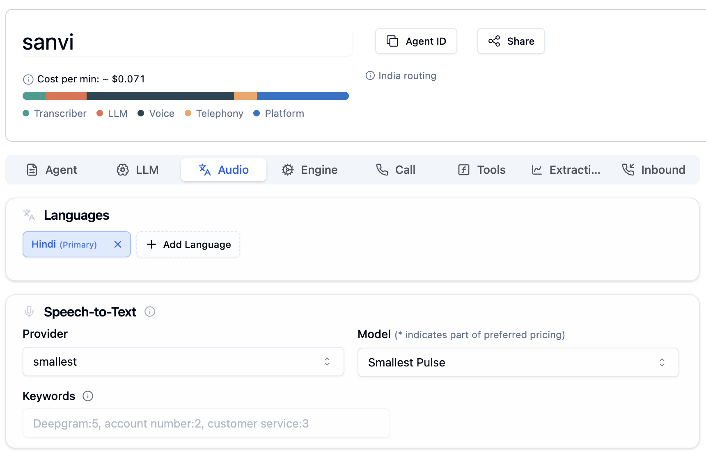
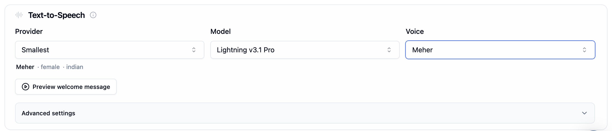

import { CodingAgentCallout } from "@/components/CodingAgentCallout";

This guide walks you through configuring [Smallest AI](https://smallest.ai) as the TTS and STT provider in [Bolna](https://www.bolna.ai), an open-source platform for building and deploying voice agents over telephony. Bolna lets you pick a provider independently per capability — use Smallest AI for both TTS and STT, or mix it with other providers, straight from Bolna's dashboard **Provider** dropdowns or via the SDK.

## Prerequisites

- A [Bolna](https://github.com/bolna-ai/bolna) instance — self-hosted (see the [bolna repository](https://github.com/bolna-ai/bolna)) or via the Bolna dashboard
- A Smallest AI API key — get one from the [Smallest AI dashboard](https://waves.smallest.ai)

---

## Setup

Bolna offers two ways to configure providers: the dashboard's [Audio tab](https://www.bolna.ai/docs/agent-setup/audio-tab) (no code), or the Python SDK directly.

### Dashboard

In your agent's **Audio** tab:

- **Speech-to-Text**: choose **Smallest** from the **Provider** dropdown and select **Pulse** as the model.
- **Text-to-Speech**: choose **Smallest** from the **Provider** dropdown and select **Lightning v3.1 Pro** as the model.





### Code (SDK)

Set `provider="smallest"` on both the `Transcriber` and `Synthesizer` when building an `Assistant`:

```python
from bolna.models import Transcriber, Synthesizer, SmallestConfig

# Speech to text (Pulse)
transcriber = Transcriber(
    provider="smallest",
    model="pulse",
    language="en",
    stream=True,
)

# Text to speech (Lightning)
synthesizer = Synthesizer(
    provider="smallest",
    provider_config=SmallestConfig(
        voice_id="<voice_id>",
        voice="<voice_name>",
        language="en",
        model="lightning_v3.1_pro",
    ),
    stream=True,
    audio_format="wav",
)
```

Set `SMALLEST_API_KEY` in your environment — see the provider table in [`README.md`](https://github.com/bolna-ai/bolna#readme). You can also pass a key directly per-agent via `transcriber_key` / `synthesizer_key`.

<Warning>
Always pass `model="pulse"` explicitly on `Transcriber`. Bolna's top-level `Transcriber.model` field defaults to `"nova-2"`, and that default is passed straight through regardless of `provider` — leaving `model` unset with `provider="smallest"` sends an invalid model to Smallest AI.
</Warning>

## Configuration Reference

The fields below apply to the SDK path. The dashboard's Audio tab exposes a subset of these (Provider, Model, Language) as dropdowns for both STT and TTS.

| Field | Capability | Default | Description |
| --- | --- | --- | --- |
| `Transcriber.provider` | STT | — | Set to `"smallest"` to route to Smallest AI |
| `Transcriber.model` | STT | `"pulse"` in the Smallest provider class, but `"nova-2"` at the `Transcriber` field level — always set it explicitly | Only `pulse` is wired to the realtime endpoint |
| `Transcriber.language` | STT | `"en"` in the Smallest provider class if unset | ISO language code |
| `Transcriber.sampling_rate` / `encoding` | STT | n/a | Always auto-set from the telephony provider (mulaw/8kHz, linear16/8kHz, or linear16/16kHz — see Notes); cannot be overridden via config |
| `Transcriber.endpointing` | STT | `400` (ms) | Silence duration before finalizing an utterance |
| `Transcriber.keywords` | STT | `None` | Accepted by the config but currently a no-op — not yet wired into the Smallest AI request |
| `SmallestConfig.model` | TTS | — (required) | `lightning_v3.1_pro` (premium pool) — passes straight through to the API |
| `SmallestConfig.voice_id` / `voice` | TTS | — (required) | Catalog or cloned voice, scoped to the selected model |
| `SmallestConfig.language` | TTS | — (required) | Language code — see the [Lightning voices & languages guide](/models/documentation/text-to-speech-lightning/voices-languages) |
| `Synthesizer.audio_format` | TTS | `"pcm"` at the field level, but Bolna's Smallest synthesizer always returns `wav` | Audio container format |

## Notes

- Bolna routes TTS requests to `https://api.smallest.ai/waves/v1/tts` (HTTP) / `wss://api.smallest.ai/waves/v1/tts/live` (streaming), and STT requests to `wss://api.smallest.ai/waves/v1/stt/live`.
- Telephony audio encoding/sample rate for STT is unconditionally auto-configured per provider: mulaw @ 8kHz for Twilio and SIP trunks, linear16 @ 8kHz for Exotel/Plivo, linear16 @ 16kHz for web calls.
- Keyword boosting in the dashboard's STT settings doesn't apply to Smallest AI per [Bolna's Audio tab docs](https://www.bolna.ai/docs/agent-setup/audio-tab) — consistent with `Transcriber.keywords` being a no-op for Smallest AI at the SDK level too.
- For issues with the Smallest AI integration in Bolna, open an issue in the [Bolna repository](https://github.com/bolna-ai/bolna) or contact us on [Discord](https://discord.gg/9WtSXv26WE).

<CodingAgentCallout />

{/* coding-agent-callout-injected */}
