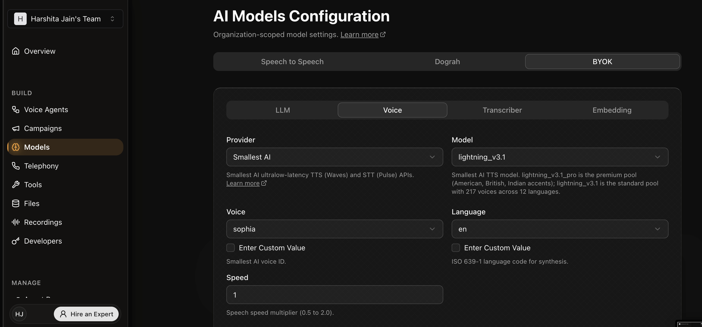
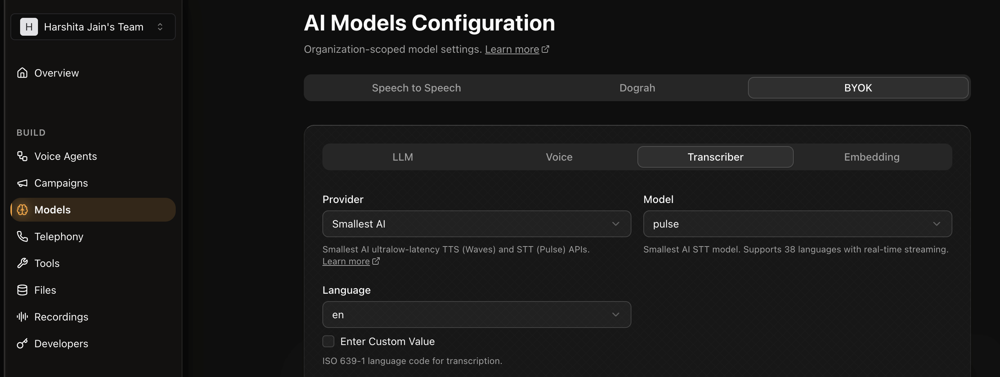

This guide walks you through configuring [Smallest AI](https://smallest.ai) as the TTS and STT provider in [Dograh](https://www.dograh.com), an open-source platform for building and deploying voice agents. Dograh lets you swap speech providers independently — you can use Smallest AI for both TTS and STT, or mix providers as needed.

## Prerequisites

- A [Dograh](https://www.dograh.com) account (self-hosted or cloud)
- A Smallest AI API key — get one from the [Smallest AI dashboard](https://waves.smallest.ai)

---

## Setup

<Steps>
  <Step title="Open the Models page">
    Navigate to [https://app.dograh.com/workflow](https://app.dograh.com/workflow) and click **Models** in the left sidebar.
  </Step>
  <Step title="Open the BYOK tab">
    In the **AI Models Configuration** section, click the **BYOK** tab at the top. This is where you configure third-party providers including Smallest AI.
  </Step>
  <Step title="Configure TTS (Voice tab)">
    Click the **Voice** sub-tab. Set **Provider** to **Smallest AI** and choose your **Model**:

    - `lightning_v3.1` — standard pool with 217 voices across 12 languages
    - `lightning_v3.1_pro` — premium pool with curated American, British, and Indian voices at 44.1 kHz

    Select a **Voice** from the dropdown (voices are scoped to the model), set the **Language**, and optionally adjust **Speed** (0.5–2.0).

    
  </Step>
  <Step title="Configure STT (Transcriber tab)">
    Click the **Transcriber** sub-tab. Set **Provider** to **Smallest AI** — the **Model** will be set to `pulse` automatically. Select your **Language** and enter your **Smallest AI API key** in the **API Key(s)** field.

    
  </Step>
</Steps>

---

## Notes

- Dograh routes TTS requests to `wss://api.smallest.ai/waves/v1/tts/live` and STT requests to `wss://api.smallest.ai/waves/v1/pulse/get_text` using the Pipecat service implementations under the hood.
- For issues with the Smallest AI integration in Dograh, open an issue in the [Dograh repository](https://github.com/dograh-hq/dograh) or contact us on [Discord](https://discord.gg/9WtSXv26WE).
