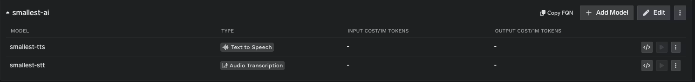

[TrueFoundry AI Gateway](https://www.truefoundry.com/ai-gateway) is the proxy layer that sits between your applications and LLM providers. It is an enterprise-grade platform that enables users to access 1000+ LLMs using a unified interface while taking care of observability and governance.

Once configured, you call TTS and STT through your TrueFoundry gateway URL instead of directly — giving you request tracing and centralised access control across your team.

## Setup

### Step 1: Navigate to Smallest AI Models

In the TrueFoundry dashboard, go to **AI Gateway** → **Models** and select **Smallest AI**.



### Step 2: Add a Smallest AI Account

Click **Add Smallest AI Account**. Enter a unique account name and your Smallest AI API key. Optionally add collaborators so other users or teams can access this account.

### Step 3: Register Models

Click **+ Add Model** and fill in the **Display name**, **Model ID**, and **Model type** (Text to Speech or Audio Transcription).

<Warning>
  For Smallest AI, the **Model ID** and **Display name** must be identical (e.g. `smallest-tts`, `smallest-stt`).
</Warning>

## Supported APIs

| API | Gateway endpoint | Tracing | Cost tracking |
|-----|-----------------|---------|---------------|
| Text-to-Speech | `/tts/{providerAccountName}/waves/v1/smallest-tts/get_speech` | ✓ | — |
| Speech-to-Text | `/stt/{providerAccountName}/waves/v1/smallest-stt/get_text` | ✓ | — |

Replace `{providerAccountName}` with the account name you set in Step 2.

## Text-to-Speech

```python
import requests

TFY_API_KEY = "your-truefoundry-api-key"
GATEWAY_BASE_URL = "your-gateway-base-url"
PROVIDER_ACCOUNT = "your-provider-account-name"

response = requests.post(
    f"{GATEWAY_BASE_URL}/tts/{PROVIDER_ACCOUNT}/waves/v1/smallest-tts/get_speech",
    headers={
        "Authorization": f"Bearer {TFY_API_KEY}",
        "Content-Type": "application/json",
    },
    json={
        "text": "Modern problems require modern solutions.",
        "voice_id": "magnus",
        "sample_rate": 24000,
        "speed": 1.0,
        "language": "en",
        "output_format": "wav",
    },
)

with open("output.wav", "wb") as f:
    f.write(response.content)

print(f"Saved output.wav ({len(response.content):,} bytes)")
```

<Note>
  For the full list of voices, sample rates, languages, and output formats, see the [Voices & Languages](/models/documentation/text-to-speech-lightning/voices-languages) page.
</Note>

## Speech-to-Text

```python
import requests

TFY_API_KEY = "your-truefoundry-api-key"
GATEWAY_BASE_URL = "your-gateway-base-url"
PROVIDER_ACCOUNT = "your-provider-account-name"

response = requests.post(
    f"{GATEWAY_BASE_URL}/stt/{PROVIDER_ACCOUNT}/waves/v1/smallest-stt/get_text",
    params={"language": "en"},
    headers={
        "Authorization": f"Bearer {TFY_API_KEY}",
        "Content-Type": "application/json",
    },
    json={
        "url": "https://github.com/smallest-inc/cookbook/raw/main/speech-to-text/getting-started/samples/audio.wav",
    },
    timeout=120,
)

result = response.json()
print(result["transcription"])
```

<Note>
  Cost tracking for Smallest AI usage is not metered by the TrueFoundry gateway. Tracing and request logging remain fully functional.
</Note>

## Links

<CardGroup cols={2}>
  <Card title="TrueFoundry Docs" icon="book" href="https://www.truefoundry.com/docs/ai-gateway/smallest-ai">
    Full setup guide on TrueFoundry
  </Card>
  <Card title="Waves API Reference" icon="code" href="https://waves-docs.smallest.ai">
    Smallest AI API reference
  </Card>
</CardGroup>
