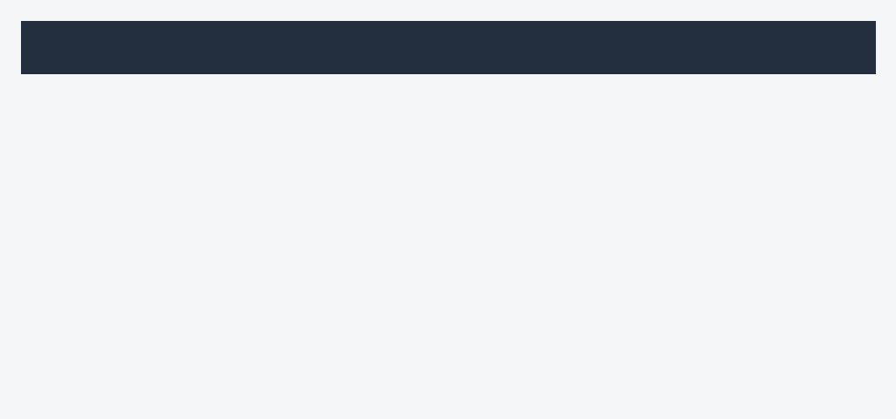

<Warning>
**Draft pending live verification against listing version `20260902-14`.** Error taxonomy and CloudWatch signatures below reflect general SageMaker Marketplace behaviour. Container-specific failure modes for this listing (Pulse) will be added after live deployment on account `AdministratorAccess-979023696888` and capture of real error responses.
</Warning>

## Endpoint stuck in `Creating` for more than 15 minutes

**Where to look:** CloudWatch Logs, log group `/aws/sagemaker/Endpoints/<endpoint-name>`.

**Common causes:**

- **Model artifact download timed out.** Marketplace containers can be several GB. Bump `ModelDataDownloadTimeoutInSeconds` on the endpoint configuration from 600 to 1800.
- **GPU quota exhausted.** Check **Service Quotas → SageMaker → `ml.g5.xlarge for endpoint usage`** in the target region. Default is 2 for new accounts; request an increase before you hit prod.
- **Subscription not accepted.** If Terraform tries to create an endpoint before the EULA is accepted in the console, model creation fails silently. Accept the EULA on the [listing page](https://aws.amazon.com/marketplace/pp/prodview-tf5i65efzgtco) first.

## `AccessDeniedException` on `InvokeEndpoint`

The caller's IAM identity is missing `sagemaker:InvokeEndpoint` (and, for streaming, `sagemaker:InvokeEndpointWithResponseStream`) on the specific endpoint ARN. Attach:

```json
{
  "Version": "2012-10-17",
  "Statement": [{
    "Effect": "Allow",
    "Action": [
      "sagemaker:InvokeEndpoint",
      "sagemaker:InvokeEndpointWithResponseStream"
    ],
    "Resource": "arn:aws:sagemaker:REGION:ACCOUNT_ID:endpoint/ENDPOINT_NAME"
  }]
}
```

A wildcard on the resource (`"Resource": "*"`) also works but is looser than most auditors will accept.

## `ModelError` (HTTP 424) on every request

The container returned a non-2xx to SageMaker. Root causes, in order of frequency:

1. **Malformed request body.** SageMaker forwards the body verbatim; a JSON parse failure inside the container surfaces as `ModelError`, not `ValidationException`. Log the raw request body and diff against the [request field tables](/models/self-host/amazon-sagemaker/invoke#request-fields) once those are verified.
2. **Audio format not supported.** Container-specific list of accepted formats to be documented after live verification.
3. **Container OOM.** Watch CloudWatch `MemoryUtilization`. If it climbs to ~100% before the crash, the endpoint needs a bigger instance.

## `ThrottlingException` under load

The endpoint is invocation-bound at the current instance count. Two fixes:

- **Immediate:** raise `initial_instance_count` on the endpoint configuration and update the endpoint.
- **Sustainable:** attach Application Auto Scaling on `SageMakerVariantInvocationsPerInstance`. Terraform template in [Deploy with Terraform → Autoscaling](/models/self-host/amazon-sagemaker/deploy-terraform#optional-application-auto-scaling).

Common mistake: setting `target_value` too high (500). Lower it until `ModelLatency` p95 sits within your SLO.

## Autoscaling not scaling out

Check the CloudWatch metric that the scaling policy targets. The default (`SageMakerVariantInvocationsPerInstance`) is published every minute; a fast burst that resolves within 60 seconds does not trigger a scale-out. For latency-sensitive workloads, alarm on `ModelLatency` directly and use step-scaling instead of target-tracking.

Also confirm the endpoint variant name in the scaling target matches your endpoint configuration (`variant/primary` by default in the Terraform template).

## Endpoint deleted but bill keeps arriving

Delete order matters:

1. **Endpoint** (`aws sagemaker delete-endpoint`). Stops instance-hour charges.
2. **Endpoint configuration** (`delete-endpoint-config`). Cosmetic, no billing impact.
3. **Model** (`delete-model`). Cosmetic, no billing impact.

Only step 1 stops charges. The Marketplace subscription itself has no cost while no endpoint is running.

## CloudWatch signatures worth watching

<Frame caption="Endpoint CloudWatch metrics dashboard. Screenshot pending live capture; account ID redacted.">
  
</Frame>

Container stderr and stdout land in CloudWatch Logs under `/aws/sagemaker/Endpoints/<endpoint-name>`. Filter patterns that catch real problems on this listing will be added after live testing surfaces them.

## Getting a support ticket answered fast

If you email `support@smallest.ai`, include:

- Endpoint name and AWS region.
- Timestamp (UTC) of a failing request.
- Response body of a failing invocation. Redact PII.
- CloudWatch log snippet from `/aws/sagemaker/Endpoints/<endpoint-name>` around the failure.
- Container version (visible in the model's `PrimaryContainer.Image` field).

For AWS billing, quota, or console errors, open a ticket in the AWS Console; those are outside our support scope.
