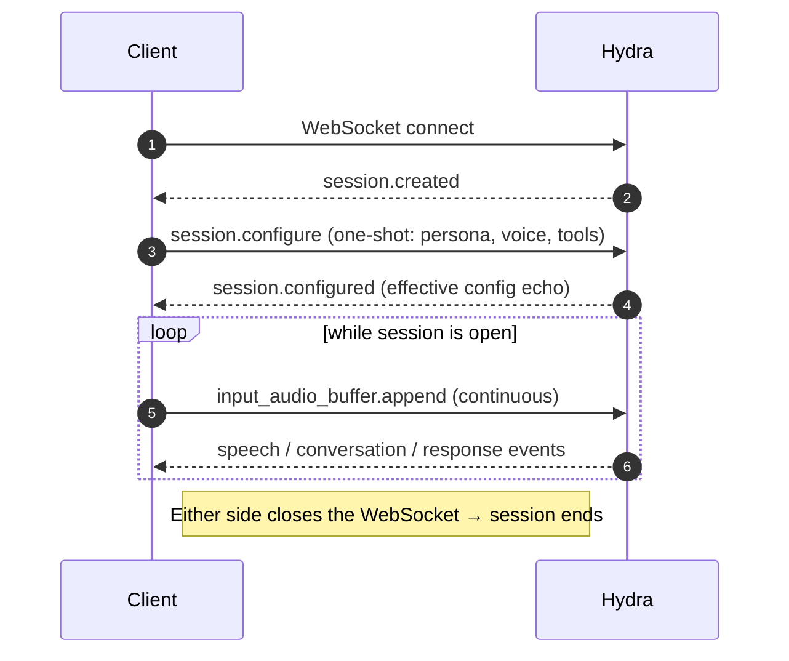

A Hydra session is the stateful interaction between the model and one connected client. One WebSocket = one session.

## Lifecycle



The handshake is **one-shot**. After `session.created`, the server waits for exactly one `session.configure` before accepting audio. Subsequent `session.configure` frames are ignored — use `session.update` for mid-session changes.

## `session.configure`

Send this once, immediately after `session.created`. Every field is optional.

```json
{
  "type": "session.configure",
  "session": {
    "instructions": "You are a warm, concise voice assistant. Reply in one short sentence.",
    "voice": "wren",
    "tools": [],
    "generate_initial_response": false
  }
}
```

| Field | Type | Notes |
|---|---|---|
| `instructions` | string | System prompt. See [Prompting voice agents](/models/documentation/speech-to-speech-hydra/prompting-voice-agents). |
| `voice` | string | One of `wren`, `sloane`, `marlowe`, `reed`, `knox`, `tate`. Unknown values silently fall back to the default — **validate client-side**. |
| `tools` | array | Function-calling tool schemas. See [Tool calling](/models/documentation/speech-to-speech-hydra/tool-calling). |
| `generate_initial_response` | boolean | `true` makes the model speak first, before any user audio. Honoured only at handshake. |

<Warning>
`session.configure` silently accepts unknown fields — a typo like `instuctions` is ignored, not rejected, and the default persona ships instead. Validate keys client-side. `session.update` is stricter and returns an `invalid_frame` error on unknown fields.
</Warning>

## `session.configured` (server echo)

```json
{
  "type": "session.configured",
  "event_id": "sv_df88e2e7ef6145c7",
  "session": {
    "instructions": "...",
    "voice": "wren",
    "tools": [],
    "generate_initial_response": false
  }
}
```

## Mid-session updates

Use `session.update` to live-patch the session without reconnecting. **Only the `tools` field is honoured today.** Persona, voice, and audio formats are frozen at handshake; changes to those require a fresh connection.

```json
{
  "type": "session.update",
  "session": {
    "tools": [
      { "type": "function", "name": "get_weather", "description": "...", "parameters": { ... } }
    ]
  }
}
```

The server replies with `session.updated` containing **only** the fields it actually applied. A no-op patch produces no echo.

## Bot speaks first

Setting `generate_initial_response: true` on `session.configure` makes Hydra deliver an opening line before any user audio arrives. Useful for greetings and concierge openers.

```json
{
  "type": "session.configure",
  "session": {
    "instructions": "You are a hotel concierge. Greet the guest warmly and ask how you can help.",
    "voice": "wren",
    "generate_initial_response": true
  }
}
```

Immediately after `session.configured`, the standard `response.created` → audio deltas → `response.done` sequence fires, with **no preceding `input_audio_buffer.speech_started`**.

## Conversation items

Most events carry a `ConversationItem`. The shape is intentionally flat — every field is optional, presence is dictated by `type`.

```json
{
  "id": "item_…",
  "type": "message" | "function_call" | "function_call_output",
  "role": "user" | "assistant" | "system",
  "status": "in_progress" | "completed" | "incomplete",
  "content": [
    { "type": "input_audio" | "output_audio" | "input_text" | "output_text" }
  ],
  "call_id": "call_…",
  "name": "get_weather",
  "arguments": "{...json...}",
  "output": "..."
}
```

Discarded user turns — speech that VAD started but the turn detector later rejected — arrive as `conversation.item.done` with `status: "incomplete"`. Silence and sub-VAD noise produce no events at all.

## `response.done`

Every response ends with `response.done`:

```json
{
  "type": "response.done",
  "response": {
    "id": "resp_…",
    "status": "completed" | "cancelled" | "incomplete" | "failed",
    "status_details": { "reason": "...", "type": "...", "error": { ... } },
    "output": [ /* ConversationItem */ ],
    "usage": { "input_tokens": 0, "output_tokens": 0, "total_tokens": 0 }
  }
}
```

| `status` | Meaning |
|---|---|
| `completed` | Turn finished normally |
| `cancelled` • `reason: "interrupted"` | The user barged in — handled automatically |
| `cancelled` • `reason: "client_cancelled"` | The client sent `response.cancel` |
| `incomplete` | Stop condition (`max_output_tokens`, `content_filter`) |
| `failed` | Internal error — see `status_details.error` |

## Next

- [Audio I/O](/models/documentation/speech-to-speech-hydra/audio-i-o) — what to put in `input_audio_buffer.append` and how to play `response.output_audio.delta`
- [Turn detection & barge-in](/models/documentation/speech-to-speech-hydra/turn-detection-barge-in) — how speech events fire and how to handle interruption on the client
- [Tool calling](/models/documentation/speech-to-speech-hydra/tool-calling) — declare and execute functions during a session
