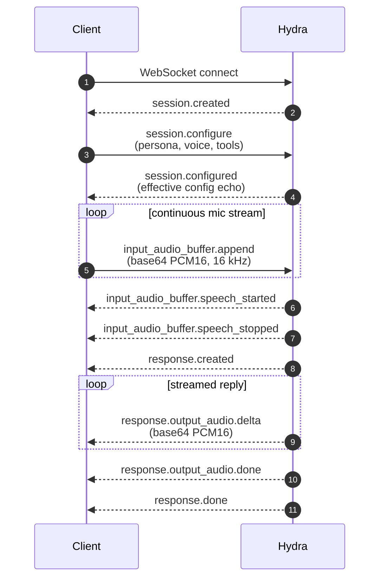

Hydra is a **realtime speech-to-speech** model. The client streams microphone audio over a WebSocket, the model returns synthesised speech in the same socket, and turn-taking is handled server-side. There is **no transcript on the wire** — audio bytes are the payload.

If you've used the OpenAI Realtime API, Hydra fills the same role on the Smallest AI stack.

## Common use cases

<CardGroup cols={2}>
  <Card title="Phone agents" icon="phone">
    Sub-second latency from end-of-user-speech to first audio chunk. Drop-in for outbound and inbound voice flows.
  </Card>
  <Card title="In-product voice copilots" icon="comments">
    Hands-free assistants embedded in web and mobile apps — barge-in handled by the model.
  </Card>
  <Card title="Kiosks & in-car" icon="car">
    One WebSocket, predictable failure modes, no STT/LLM/TTS glue to maintain.
  </Card>
  <Card title="Voice-first consumer apps" icon="user-headset">
    Companions, audio diaries, language tutors — natural turn-taking out of the box.
  </Card>
</CardGroup>

## What's on the wire

Two things to know up front:

- **Stream audio continuously** — no manual `commit` or `end-of-turn`. Hydra detects turn boundaries on its own.
- **Full-duplex** — the user can speak over the model. The in-flight response cancels automatically with `status: "cancelled"`, `reason: "interrupted"`.

## Next

<CardGroup cols={2}>
  <Card title="Quickstart" icon="rocket" href="/models/documentation/speech-to-speech-hydra/quickstart">
    Clone the reference client, paste your API key, and talk to Hydra in your browser.
  </Card>
  <Card title="WebSocket connection" icon="plug" href="/models/documentation/speech-to-speech-hydra/web-socket-connection">
    Connect URL, auth, idle timeout, close codes. Python + Node + Browser snippets.
  </Card>
  <Card title="Managing sessions" icon="diagram-project" href="/models/documentation/speech-to-speech-hydra/managing-sessions">
    Session lifecycle, persona, voice, mid-session updates, conversation items.
  </Card>
  <Card title="Turn detection & barge-in" icon="wave-pulse" href="/models/documentation/speech-to-speech-hydra/turn-detection-barge-in">
    How the model detects speech, how to handle barge-in cleanly on the client.
  </Card>
  <Card title="Tool calling" icon="screwdriver-wrench" href="/models/documentation/speech-to-speech-hydra/tool-calling">
    Declare tools, stream arguments, post results back, narrate the answer.
  </Card>
  <Card title="Prompting voice agents" icon="masks-theater" href="/models/documentation/speech-to-speech-hydra/prompting-voice-agents">
    System prompts, voice identity, length discipline, tool-call prompting.
  </Card>
</CardGroup>

## Related

- [Model card — Hydra](/models/model-cards/speech-to-speech/hydra) — voices, performance, pricing
- [Reference client (Next.js)](https://github.com/smallest-inc/hydra_agents) — production-grade browser client with barge-in, multi-agent presets, tool execution
