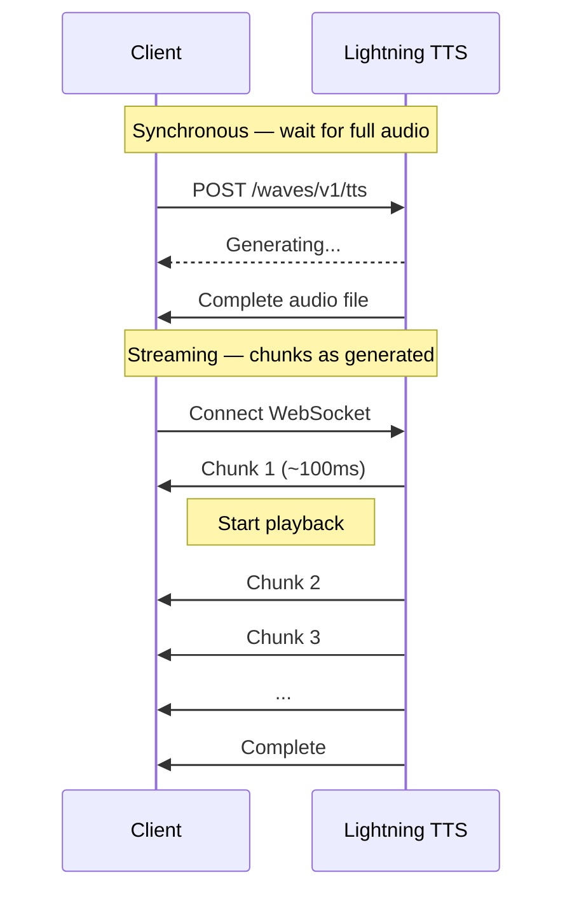

Streaming TTS delivers audio chunks as they're generated — playback starts immediately instead of waiting for the full file. First chunk arrives in ~100ms.

**Streamed audio output:**

<audio controls style={{ width: '100%', maxWidth: '500px' }}>
  <source src="../../audio/tts-sample-hello.wav" type="audio/wav" />
  Your browser does not support the audio element.
</audio>



## WebSocket Streaming

Persistent connections for continuous, low-latency audio. Best for conversational AI and real-time apps.

**Endpoint:** `wss://api.smallest.ai/waves/v1/tts/live`

<Tip>
Pass `word_timestamps: true` on the WebSocket request to receive per-word timing events (`status: "word_timestamp"`) interleaved with the audio chunks — useful for live captions, karaoke-style highlighting, and avatar lip-sync. Words come back verbatim from the input text (`"$100"` stays `"$100"`, not normalized). Supported on English + Hindi base-queue voices. See [Word-level timestamps](/models/model-cards/text-to-speech/lightning-v-3-1#word-level-timestamps) on the Lightning v3.1 model card for the wire shape, voice support matrix, and a worked example.
</Tip>

<CodeGroup>

```python Python
# ci:skip — requires sounddevice + an audio device, not available in CI
# Plays audio chunks as they arrive AND saves the full stream to streamed.wav.
# Requires: pip install websockets sounddevice numpy
import asyncio
import base64
import json
import os
import wave

import numpy as np
import sounddevice as sd
import websockets

API_KEY = os.environ["SMALLEST_API_KEY"]
WS_URL = "wss://api.smallest.ai/waves/v1/tts/live"
SAMPLE_RATE = 24000

async def stream_tts(text):
    audio_chunks = []
    # Open a non-blocking output stream so each chunk plays as it arrives.
    stream = sd.OutputStream(samplerate=SAMPLE_RATE, channels=1, dtype="int16")
    try:
        stream.start()
        async with websockets.connect(
            WS_URL,
            additional_headers={"Authorization": f"Bearer {API_KEY}"},
        ) as ws:
            await ws.send(json.dumps({
                "text": text,
                "voice_id": "meher",
                "model": "lightning_v3.1_pro",
                "sample_rate": SAMPLE_RATE,
            }))

            while True:
                data = json.loads(await ws.recv())
                status = data.get("status")
                if status == "chunk":
                    pcm = base64.b64decode(data["data"]["audio"])
                    audio_chunks.append(pcm)
                    # Play immediately (16-bit mono PCM).
                    stream.write(np.frombuffer(pcm, dtype=np.int16))
                elif status == "complete":
                    break
    finally:
        # Always release the audio device, even if the WS errored mid-stream.
        stream.stop(); stream.close()

    with wave.open("streamed.wav", "wb") as wf:
        wf.setnchannels(1); wf.setsampwidth(2); wf.setframerate(SAMPLE_RATE)
        wf.writeframes(b"".join(audio_chunks))
    print(f"Saved streamed.wav ({len(audio_chunks)} chunks)")

asyncio.run(stream_tts("Streaming delivers audio in real-time for voice assistants and chatbots."))
```

```javascript JavaScript
const WebSocket = require("ws");
const fs = require("fs");

const API_KEY = process.env.SMALLEST_API_KEY;

const ws = new WebSocket(
  "wss://api.smallest.ai/waves/v1/tts/live",
  { headers: { Authorization: `Bearer ${API_KEY}` } }
);

const audioChunks = [];

ws.on("open", () => {
  ws.send(JSON.stringify({
    text: "Streaming delivers audio in real-time for voice assistants and chatbots.",
    voice_id: "meher",
    model: "lightning_v3.1_pro",
    sample_rate: 24000,
  }));
});

ws.on("message", (raw) => {
  const data = JSON.parse(raw);

  if (data.status === "chunk") {
    audioChunks.push(Buffer.from(data.data.audio, "base64"));
  } else if (data.status === "complete") {
    const audio = Buffer.concat(audioChunks);
    // Add WAV header and save
    fs.writeFileSync("streamed.pcm", audio);
    console.log(`Saved streamed.pcm (${audioChunks.length} chunks)`);
    ws.close();
  }
});
```

```python Python SDK
# Requires `smallestai>=5.1.0` for the unified `/waves/v1/tts/live` WS
# endpoint. Pass `model="lightning_v3.1"` (default) or `"lightning_v3.1_pro"`
# to select the pool.
import os
import wave
from smallestai.waves import TTSConfig, WavesStreamingTTS

config = TTSConfig(
    voice_id="magnus",
    api_key=os.environ["SMALLEST_API_KEY"],
    sample_rate=24000,
    speed=1.0,
    max_buffer_flush_ms=100,
)

streaming_tts = WavesStreamingTTS(config)

text = "Streaming delivers audio in real-time for voice assistants and chatbots."
audio_chunks = list(streaming_tts.synthesize(text))

with wave.open("streamed.wav", "wb") as wf:
    wf.setnchannels(1)
    wf.setsampwidth(2)
    wf.setframerate(24000)
    wf.writeframes(b"".join(audio_chunks))
```

</CodeGroup>

## SSE Streaming

Server-Sent Events over HTTP — simpler to set up, no persistent connection needed.

**Endpoint:** `POST https://api.smallest.ai/waves/v1/tts/live`

<CodeGroup>

```python Python
# ci:skip — requires sounddevice + an audio device, not available in CI
# Plays audio chunks as they arrive AND saves the full stream to sse_output.wav.
# Requires: pip install requests sounddevice numpy
import base64
import json
import os
import wave

import numpy as np
import requests
import sounddevice as sd

API_KEY = os.environ["SMALLEST_API_KEY"]
SAMPLE_RATE = 24000

response = requests.post(
    "https://api.smallest.ai/waves/v1/tts/live",
    headers={
        "Authorization": f"Bearer {API_KEY}",
        "Content-Type": "application/json",
        "Accept": "text/event-stream",
    },
    json={
        "text": "SSE streaming is simpler to set up than WebSocket.",
        "voice_id": "meher",
        "model": "lightning_v3.1_pro",
        "sample_rate": SAMPLE_RATE,
    },
    stream=True,
)
response.raise_for_status()

audio_chunks = []
stream = sd.OutputStream(samplerate=SAMPLE_RATE, channels=1, dtype="int16")
try:
    stream.start()
    for line in response.iter_lines():
        if not line:
            continue
        decoded = line.decode()
        if not decoded.startswith("data: "):
            continue
        data = json.loads(decoded[6:])
        if data.get("done"):
            break
        if data.get("audio"):
            pcm = base64.b64decode(data["audio"])
            audio_chunks.append(pcm)
            # Play immediately as each chunk arrives.
            stream.write(np.frombuffer(pcm, dtype=np.int16))
finally:
    # Always release the audio device, even if the stream errored mid-flight.
    stream.stop(); stream.close()

with wave.open("sse_output.wav", "wb") as wf:
    wf.setnchannels(1); wf.setsampwidth(2); wf.setframerate(SAMPLE_RATE)
    wf.writeframes(b"".join(audio_chunks))
print(f"Saved sse_output.wav ({len(audio_chunks)} chunks)")
```

```bash cURL
curl -N -X POST "https://api.smallest.ai/waves/v1/tts/live" \
  -H "Authorization: Bearer $SMALLEST_API_KEY" \
  -H "Content-Type: application/json" \
  -H "Accept: text/event-stream" \
  -d '{
    "text": "SSE streaming is simpler to set up than WebSocket.",
    "voice_id": "meher",
    "model": "lightning_v3.1_pro",
    "sample_rate": 24000
  }'
```

</CodeGroup>

## Streaming Text Input (SDK)

For real-time applications where text arrives incrementally (e.g., from an LLM), the SDK supports streaming text input:

```python
# ci:skip — requires sounddevice + an audio device, not available in CI
# Requires `smallestai>=4.4.0`, plus: pip install sounddevice numpy
import os

import numpy as np
import sounddevice as sd
from smallestai.waves import TTSConfig, WavesStreamingTTS

SAMPLE_RATE = 24000
config = TTSConfig(voice_id="magnus", api_key=os.environ["SMALLEST_API_KEY"], sample_rate=SAMPLE_RATE)
streaming_tts = WavesStreamingTTS(config)

def text_stream():
    """Simulates text arriving word by word (e.g., from an LLM)."""
    text = "Streaming synthesis with chunked text input."
    for word in text.split():
        yield word + " "

stream = sd.OutputStream(samplerate=SAMPLE_RATE, channels=1, dtype="int16")
try:
    stream.start()
    for chunk in streaming_tts.synthesize_streaming(text_stream()):
        # Each chunk is raw 16-bit PCM. Play it immediately.
        stream.write(np.frombuffer(chunk, dtype=np.int16))
finally:
    # Always release the audio device, even if synthesis errored.
    stream.stop(); stream.close()
```

## WebSocket vs SSE

| | WebSocket | SSE |
|---|---|---|
| **Connection** | Persistent, bidirectional | New HTTP request each time |
| **Multiple messages** | Reuse same connection | New request per message |
| **Best for** | Voice assistants, chatbots | Simple one-off streaming |
| **Latency** | Lowest (no reconnect overhead) | Slightly higher |
| **Concurrency** | Up to 5 connections per unit | Per-request |

<Tip>
Use **WebSocket** when sending multiple TTS requests over time (conversations, voice bots). Use **SSE** for simple one-shot streaming where you don't need a persistent connection.
</Tip>

## Response Format

The two transports emit different JSON shapes — match your parser to the transport you're using.

**WebSocket** — each message is a nested envelope:
```json
// audio chunk
{ "status": "chunk", "data": { "audio": "base64_encoded_pcm_data" } }

// stream complete
{ "status": "complete", "message": "All chunks sent", "done": true }
```
Access audio at `data["data"]["audio"]`; terminator is `data["status"] == "complete"`.

**SSE** — each `data:` line is a flat object:
```json
// audio chunk
{ "audio": "base64_encoded_pcm_data" }

// stream complete
{ "done": true }
```
Access audio at `data["audio"]`; terminator is `data["done"] == true`. SSE frames are prefixed with `event: audio\n` followed by `data: {...}\n\n`.

## Configuration Parameters

| Parameter | Default | Description |
|-----------|---------|-------------|
| `voice_id` | *required* | Voice identifier |
| `model` | `lightning_v3.1` | TTS pool to use. Pass `lightning_v3.1_pro` to route to the [Pro pool](/models/model-cards/text-to-speech/lightning-v-3-1-pro). |
| `sample_rate` | `44100` | Audio sample rate (8000–44100 Hz) |
| `speed` | `1.0` | Speech speed (0.5–2.0) |
| `language` | `en` | Language code matching the voice. Each voice's `tags.language` constrains what works — see `GET /waves/v1/lightning-v3.1/get_voices`. |
| `output_format` | `pcm` | `pcm`, `mp3`, `wav`, `ulaw`, or `alaw` |

For concurrency limits and connection management, see [Concurrency and Limits](/models/api-reference/concurrency-and-limits).


<Tip>
**Full runnable source:** [streaming-python.py](https://github.com/smallest-inc/cookbook/blob/main/text-to-speech/streaming-python.py)
</Tip>
