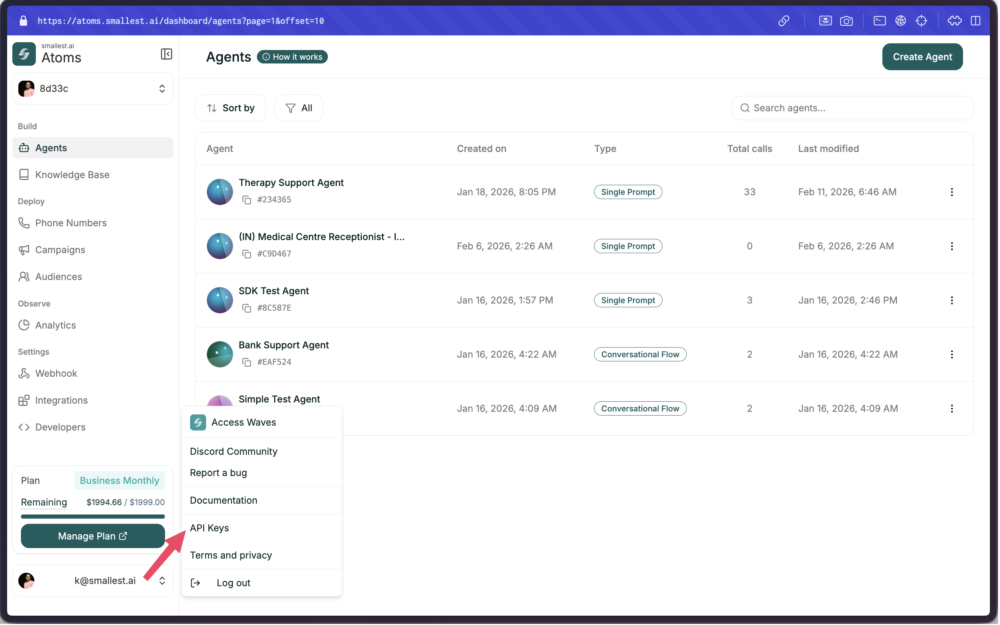

Waves is a speech AI platform by [Smallest AI](https://smallest.ai?utm_source=documentation&utm_medium=getting-started) that provides fast, accurate text-to-speech and speech-to-text APIs.

## Products

<CardGroup cols={2}>
  <Card title="Text-to-Speech" icon="volume-high" href="/waves/documentation/text-to-speech/quickstart">
    Convert text to natural-sounding speech with multiple voices and languages.
  </Card>
  <Card title="Speech-to-Text" icon="microphone" href="/waves/documentation/speech-to-text/overview">
    Transcribe audio in real-time or from files with high accuracy and low latency.
  </Card>
</CardGroup>

## Get Started

<Steps>
  <Step title="Get your API key">
    

    Head over to the [Smallest AI Console API Keys](https://app.smallest.ai/dashboard/settings/apikeys?utm_source=documentation&utm_medium=getting-started) to create your API key.
  </Step>
  <Step title="Make your first request">
    Follow the [TTS Quickstart](/waves/documentation/text-to-speech/quickstart) or [STT Quickstart](/waves/documentation/speech-to-text/quickstart) to start building.
  </Step>
</Steps>

## Resources

<CardGroup cols={4}>
  <Card title="API Reference" icon="code" href="/waves/documentation/api-references/get-voices-api">
    Explore all endpoints
  </Card>
  <Card title="Models" icon="microchip" href="/waves/documentation/getting-started/models">
    Available TTS & STT models
  </Card>
  <Card title="Cookbooks" icon="book" href="/waves/documentation/cookbooks/speech-to-text">
    Example projects
  </Card>
  <Card title="Changelog" icon="clock-rotate-left" href="/waves/documentation/changelog/announcements">
    Latest updates
  </Card>
</CardGroup>

## Support

- **Email**: [support@smallest.ai](mailto:support@smallest.ai)
- **Discord**: [Join our community](https://discord.gg/5evETqguJs)
