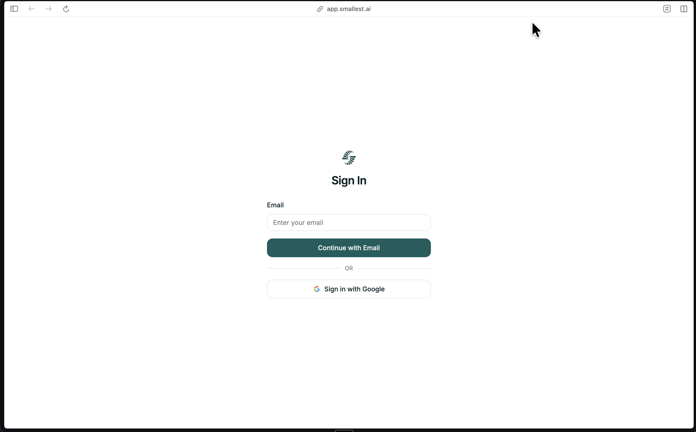
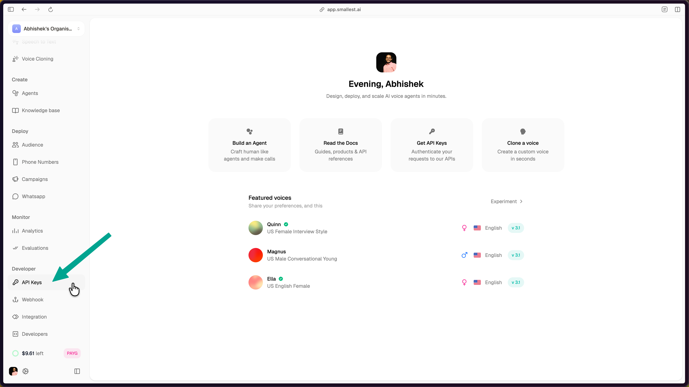
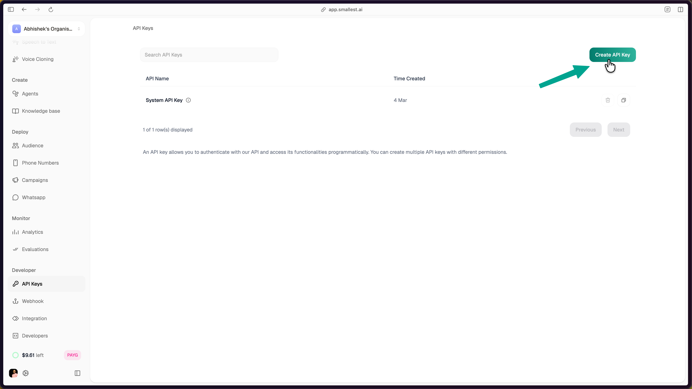
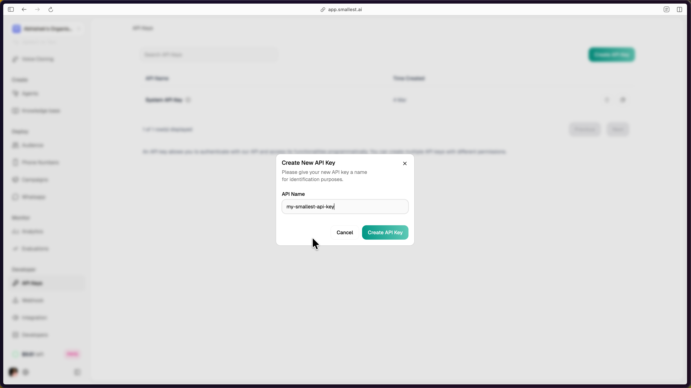
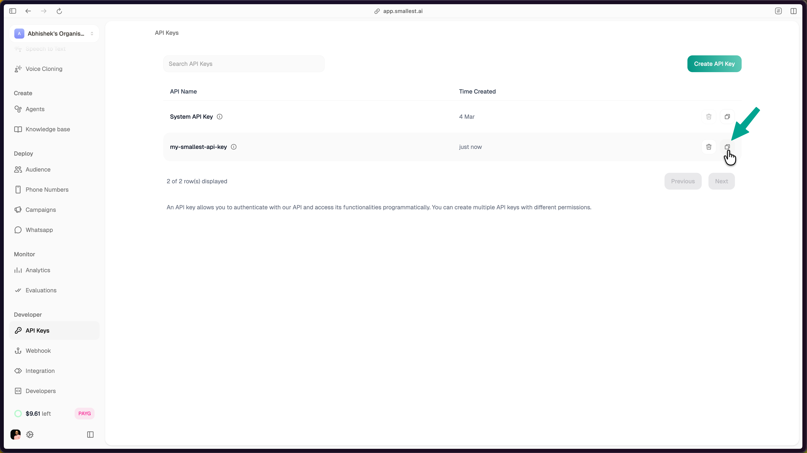

[Smallest AI](https://smallest.ai?utm_source=documentation&utm_medium=getting-started) builds speech AI models and APIs. Generate natural speech, transcribe audio in real-time, and clone voices — all through simple API calls.

## Models

<CardGroup cols={2}>
  <Card title="Lightning (Text-to-Speech)" icon="volume-high" href="/waves/documentation/text-to-speech-lightning/quickstart">
    Generate speech with 80+ voices, 44.1 kHz audio, and ~100ms latency. English, Hindi, Spanish, Tamil.
  </Card>
  <Card title="Pulse (Speech-to-Text)" icon="microphone" href="/waves/documentation/speech-to-text-pulse/quickstart">
    Transcribe audio in real-time or from files. 39 languages, speaker diarization, emotion detection.
  </Card>
</CardGroup>

## Get Your API Key

<Steps>
  <Step title="Create an account">
    Go to [app.smallest.ai](https://app.smallest.ai?utm_source=documentation&utm_medium=getting-started) and sign up with email or Google.

    
  </Step>
  <Step title="Navigate to API Keys">
    In the [Smallest AI console](https://app.smallest.ai/dashboard), select **API Keys** from the left sidebar under **Developer**.

    
  </Step>
  <Step title="Create and copy your key">
    Click the **Create API Key** button in the top-right corner.

    

    Enter a name for the key and click **Create API Key**.

    
  </Step>
  <Step title="Use your key">
    The newly created key appears in your API Keys dashboard. Click the copy icon to copy it.

    

    Set it in your terminal:

    ```bash
    export SMALLEST_API_KEY="your-api-key-here"
    ```
  </Step>
</Steps>

## Try It Now

### Generate speech (Lightning TTS)

Paste this in your terminal — no install required:

```bash
curl -X POST "https://api.smallest.ai/waves/v1/lightning-v3.1/get_speech" \
  -H "Authorization: Bearer $SMALLEST_API_KEY" \
  -H "Content-Type: application/json" \
  -d '{"text": "Hello from Smallest AI.", "voice_id": "magnus", "sample_rate": 24000, "output_format": "wav"}' \
  --output hello.wav
```

Play `hello.wav` — you should hear the same quality as the sample above.

### Transcribe audio (Pulse STT)

```bash
curl -X POST "https://api.smallest.ai/waves/v1/pulse/get_text?language=en" \
  -H "Authorization: Bearer $SMALLEST_API_KEY" \
  -H "Content-Type: application/json" \
  -d '{"url": "https://github.com/smallest-inc/cookbook/raw/main/speech-to-text/getting-started/samples/audio.wav"}'
```

You'll get back:

```json
{
  "transcription": "This is a sample audio file for testing speech to text transcription with the Pulse API."
}
```

## Next Steps

<CardGroup cols={2}>
  <Card title="TTS Quickstart" icon="rocket" href="/waves/documentation/text-to-speech-lightning/quickstart">
    Full guide with Python, JavaScript, and SDK examples.
  </Card>
  <Card title="STT Quickstart" icon="rocket" href="/waves/documentation/speech-to-text-pulse/quickstart">
    Transcribe files and stream audio in real-time.
  </Card>
  <Card title="Model Cards" icon="id-card" href="/waves/model-cards/text-to-speech/lightning-v-3-1">
    Benchmarks, specs, and capabilities.
  </Card>
  <Card title="Cookbooks" icon="book" href="/waves/documentation/cookbooks/text-to-speech">
    Production-ready example projects.
  </Card>
  <Card title="Showcase" icon="grid-2" href="https://showcase.smallest.ai/">
    See what developers have built with Smallest AI.
  </Card>
  <Card title="GitHub" icon="fa-brands fa-github" href="https://github.com/smallest-inc/cookbook">
    Open-source cookbook with 20+ examples.
  </Card>
</CardGroup>

## Community & Support

<CardGroup cols={2}>
  <Card title="Join Discord" icon="fa-brands fa-discord" href="https://discord.gg/9WtSXv26WE">
    Ask questions, share projects, and connect with other developers.
  </Card>
  <Card title="Email Support" icon="envelope" href="mailto:support@smallest.ai">
    Reach our team directly for technical assistance.
  </Card>
</CardGroup>
