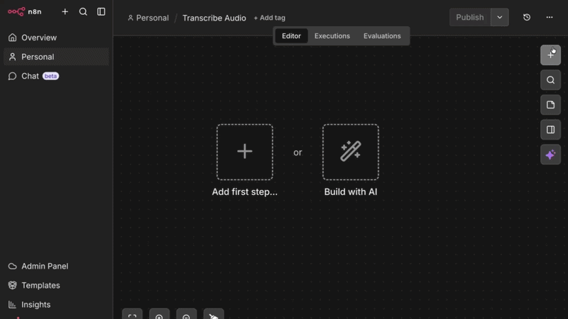

Use Smallest AI inside [n8n](https://n8n.io) to build no-code and low-code voice automations — transcribe audio, synthesize speech, and clone voices as part of any workflow using the [n8n-nodes-smallestai](https://www.npmjs.com/package/n8n-nodes-smallestai) community node.

## Installation

In your n8n instance, go to **Settings → Community Nodes → Install** and search for:

```
n8n-nodes-smallestai
```



Or install via npm (for self-hosted instances):

```bash
npm install n8n-nodes-smallestai
```

<Note>Requires n8n v1.x or v2.x and Node.js v22 or higher.</Note>

## Credentials

<Steps>
  <Step title="Sign up and navigate to API Keys">
    Sign up at [console.smallest.ai](https://console.smallest.ai) and go to **Settings → API Keys**.

    
  </Step>
  <Step title="Create a new key">
    Click **Create API Key**, give it a name, and copy the key immediately — it won't be shown again.

    
  </Step>
  <Step title="Add credentials in n8n">
    In n8n, go to **Credentials → New → Smallest.ai API**, paste your API key, and save.
  </Step>
</Steps>

## Transcribe Audio from a Form

The quickest way to try the node — a form that accepts an audio file upload and returns its transcript via the Smallest AI STT API.


### Workflow JSON

Copy and import this directly into n8n via **File → Import from JSON**:

```json
{
  "name": "Transcribe Audio",
  "nodes": [
    {
      "parameters": {
        "formTitle": "Sample Audio",
        "formDescription": "Upload a sample Audio",
        "formFields": {
          "values": [
            {
              "fieldLabel": "audio",
              "fieldType": "file",
              "acceptFileTypes": ".mp3, .wav"
            }
          ]
        },
        "options": {}
      },
      "type": "n8n-nodes-base.formTrigger",
      "typeVersion": 2.5,
      "position": [-144, -48],
      "id": "012e15bf-7dea-401f-87d8-36859543bf21",
      "name": "On form submission"
    },
    {
      "parameters": {
        "resource": "stt",
        "binaryPropertyName": "audio",
        "additionalOptions": {}
      },
      "type": "n8n-nodes-smallestai.smallestai",
      "typeVersion": 1,
      "position": [112, -48],
      "id": "b2398e55-5ed0-4e0e-915b-180d17525b42",
      "name": "Transcribe audio",
      "credentials": {
        "smallestaiApi": {
          "id": "AuVcs5R2gmnnsCxk",
          "name": "Smallest.ai account"
        }
      }
    }
  ],
  "pinData": {},
  "connections": {
    "On form submission": {
      "main": [
        [
          {
            "node": "Transcribe audio",
            "type": "main",
            "index": 0
          }
        ]
      ]
    }
  },
  "active": false,
  "settings": {
    "executionOrder": "v1",
    "binaryMode": "separate"
  },
  "tags": []
}
```


### Node Configuration

| Field | Value |
| --- | --- |
| Resource | Transcription (STT) |
| Operation | Transcribe Audio |
| Binary Property | `audio` |

Optional enrichment under **Additional Options:**

| Option | Default | Description |
| --- | --- | --- |
| `language` | `en` | Use `auto` for multilingual detection |
| `age_detection` | `false` | Detect speaker age range |
| `gender_detection` | `false` | Detect speaker gender |
| `emotion_detection` | `false` | Detect emotional tone |

## Operations

The **Smallest AI** node exposes three resources:

| Resource | Operation | Description |
| --- | --- | --- |
| Speech (TTS) | Synthesize Speech | Convert text to audio (MP3, WAV, PCM, Mulaw) |
| Speech (TTS) | Get Voices | List available voices for a model |
| Transcription (STT) | Transcribe Audio | Transcribe an audio file to text |
| Voice Clone | Add Voice | Clone a voice from an audio file |
| Voice Clone | Get Cloned Voices | List all your cloned voices |
| Voice Clone | Delete Cloned Voice | Remove a cloned voice by ID |

## Speech-to-Text (STT)

Transcribe audio in 20+ languages. The node reads binary audio data from a previous step and sends it to the Smallest AI STT API.

```
Read/Download Audio  →  Smallest AI (Transcribe Audio)  →  Use transcript
```

**Supported languages:** English, Hindi, Spanish, Tamil, French, German, Arabic, Bengali, Kannada, Malayalam, Marathi, Telugu, and more. Set `language` to `auto` for automatic detection.

**Optional detections:**

| Option | Field | Default |
| --- | --- | --- |
| Spoken language | `language` | `en` |
| Speaker age range | `age_detection` | `false` |
| Speaker gender | `gender_detection` | `false` |
| Emotional tone | `emotion_detection` | `false` |

## Text-to-Speech (TTS)

Convert any text to audio using Lightning V3.1. The node outputs binary audio data you can save, email, or pass downstream.

```
Trigger / Data  →  Smallest AI (Synthesize Speech)  →  Save / Send audio
```

**Configuration:**

| Field | Options | Default |
| --- | --- | --- |
| Model | `lightning-v3.1` | `lightning-v3.1` |
| Voice | 80+ voices | `avery` |
| Output Format | `mp3`, `wav`, `pcm`, `mulaw` | `wav` |
| Sample Rate | `8000`, `16000`, `24000`, `44100` | `44100` |
| Speed | `0.5` – `2.0` | `1.0` |

Popular voices:

| Voice | Gender | Accent |
| --- | --- | --- |
| `sophia` | Female | American |
| `robert` | Male | American |
| `advika` | Female | Indian |
| `vivaan` | Male | Indian |
| `camilla` | Female | Mexican/Latin |

## Voice Cloning

Clone a voice from an audio sample, then use the returned voice ID in any TTS step.

```
Upload Audio  →  Smallest AI (Add Voice)  →  Store Voice ID
```

```
Text input  →  Smallest AI (Synthesize Speech, Custom Voice ID)  →  Audio output
```

Set **Voice Source** to `Custom` in the TTS node and paste the cloned voice ID.

## Use Case Ideas

| Use Case | Flow |
| --- | --- |
| Meeting transcription | Download recording → Transcribe → Save to Notion / Sheets |
| Voice support tickets | Receive voice message → Transcribe → Route to agent |
| Voice note → summary | Receive audio → Transcribe → Summarise with AI |
| Podcast indexing | New episode → Transcribe → Push to CMS / search index |
| Multilingual IVR QA | Pull calls → Transcribe (auto) → Emotion flag → QA review |
| Lecture capture | Upload recording → Transcribe → Format notes → Email |

## Notes

- Audio must be passed as **binary data** in n8n. Use nodes like **Read/Write Files**, **HTTP Request**, or **Form Trigger** to load audio into the pipeline before the Smallest AI node.
- For the form-based workflow, the **Binary Property** field in the STT node must exactly match the label of the file upload field in your form.
- The node is compatible with n8n's **AI Agent** tool interface (`usableAsTool: true`) — you can use it as a tool inside an AI agent workflow.

## Links

<CardGroup cols={2}>
  <Card title="npm Package" icon="npm" href="https://www.npmjs.com/package/n8n-nodes-smallestai">
    Install from npm
  </Card>

  <Card title="GitHub" icon="github" href="https://github.com/abhishekmishragithub/n8n-nodes-smallestai">
    Source code
  </Card>

  <Card title="n8n Community Nodes" icon="webhook" href="https://docs.n8n.io/integrations/community-nodes/installation/">
    How to install community nodes
  </Card>

  <Card title="Cookbook" icon="book" href="https://github.com/smallest-inc/cookbook">
    More workflow examples
  </Card>
</CardGroup>
