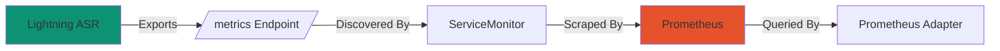

## Overview

This page focuses on collecting and validating Lightning ASR metrics with Prometheus and exposing them through the Prometheus Adapter.

<Warning>
Autoscaling documentation is currently under active development.
Use this page as a metrics reference.
If you need autoscaling now, configure your own HPA/KEDA rules using these metrics.
</Warning>

## Architecture


/* The original had a syntax error in Mermaid—edges must connect nodes, not labels. 
"Metrics" is now a node, and edge directions/names are consistent.
*/

## Components

### Prometheus

Collects and stores metrics from Lightning ASR pods.

**Included in chart**:
```yaml values.yaml
scaling:
  auto:
    enabled: true

kube-prometheus-stack:
  prometheus:
    prometheusSpec:
      serviceMonitorSelectorNilUsesHelmValues: false
      retention: 7d
      resources:
        requests:
          memory: 2Gi
```

### ServiceMonitor

CRD that tells Prometheus which services to scrape.

**Enabled for Lightning ASR**:
```yaml values.yaml
scaling:
  auto:
    lightningAsr:
      servicemonitor:
        enabled: true
```

### Prometheus Adapter

Converts Prometheus metrics to Kubernetes custom metrics API.

**Configuration**:
```yaml values.yaml
prometheus-adapter:
  prometheus:
    url: http://smallest-prometheus-stack-prometheus.default.svc
    port: 9090
  rules:
    custom:
      - seriesQuery: "asr_active_requests"
        resources:
          overrides:
            namespace: {resource: "namespace"}
            pod: {resource: "pod"}
        name:
          matches: "^(.*)$"
          as: "${1}"
        metricsQuery: "asr_active_requests{<<.LabelMatchers>>}"
      - seriesQuery: "asr_batch_queue_depth"
        resources:
          overrides:
            namespace: {resource: "namespace"}
            pod: {resource: "pod"}
        name:
          matches: "^(.*)$"
          as: "${1}"
        metricsQuery: "asr_batch_queue_depth{<<.LabelMatchers>>}"
      - seriesQuery: "asr_active_streams"
        resources:
          overrides:
            namespace: {resource: "namespace"}
            pod: {resource: "pod"}
        name:
          matches: "^(.*)$"
          as: "${1}"
        metricsQuery: "asr_active_streams{<<.LabelMatchers>>}"
      - seriesQuery: "asr_stream_queue_depth"
        resources:
          overrides:
            namespace: {resource: "namespace"}
            pod: {resource: "pod"}
        name:
          matches: "^(.*)$"
          as: "${1}"
        metricsQuery: "asr_stream_queue_depth{<<.LabelMatchers>>}"
```

## Available Metrics

Lightning ASR exposes the following metrics:

<table style={{ borderCollapse: 'separate', borderSpacing: 0, width: '100%', borderRadius: '8px', overflow: 'hidden' }}>
  <thead>
    <tr style={{ backgroundColor: 'rgba(255, 255, 255, 0.08)' }}>
      <th style={{ padding: '12px 16px', textAlign: 'left', fontWeight: '800', border: '0.5px solid rgba(209, 213, 219, 0.2)', borderTopLeftRadius: '8px' }}>Metric</th>
      <th style={{ padding: '12px 16px', textAlign: 'left', fontWeight: '800', border: '0.5px solid rgba(209, 213, 219, 0.2)' }}>Type</th>
      <th style={{ padding: '12px 16px', textAlign: 'left', fontWeight: '800', border: '0.5px solid rgba(209, 213, 219, 0.2)', borderTopRightRadius: '8px' }}>Description</th>
    </tr>
  </thead>
  <tbody>
    <tr>
      <td style={{ padding: '12px 16px', border: '0.5px solid rgba(209, 213, 219, 0.2)' }}><code>asr_active_requests</code></td>
      <td style={{ padding: '12px 16px', border: '0.5px solid rgba(209, 213, 219, 0.2)' }}>Gauge</td>
      <td style={{ padding: '12px 16px', border: '0.5px solid rgba(209, 213, 219, 0.2)' }}>Active batch requests currently being processed on GPU</td>
    </tr>
    <tr>
      <td style={{ padding: '12px 16px', border: '0.5px solid rgba(209, 213, 219, 0.2)' }}><code>asr_batch_queue_depth</code></td>
      <td style={{ padding: '12px 16px', border: '0.5px solid rgba(209, 213, 219, 0.2)' }}>Gauge</td>
      <td style={{ padding: '12px 16px', border: '0.5px solid rgba(209, 213, 219, 0.2)' }}>Requests waiting in the batch queue</td>
    </tr>
    <tr>
      <td style={{ padding: '12px 16px', border: '0.5px solid rgba(209, 213, 219, 0.2)' }}><code>asr_active_streams</code></td>
      <td style={{ padding: '12px 16px', border: '0.5px solid rgba(209, 213, 219, 0.2)' }}>Gauge</td>
      <td style={{ padding: '12px 16px', border: '0.5px solid rgba(209, 213, 219, 0.2)' }}>Active streaming sessions</td>
    </tr>
    <tr>
      <td style={{ padding: '12px 16px', border: '0.5px solid rgba(209, 213, 219, 0.2)', borderBottomLeftRadius: '8px' }}><code>asr_stream_queue_depth</code></td>
      <td style={{ padding: '12px 16px', border: '0.5px solid rgba(209, 213, 219, 0.2)' }}>Gauge</td>
      <td style={{ padding: '12px 16px', border: '0.5px solid rgba(209, 213, 219, 0.2)', borderBottomRightRadius: '8px' }}>Pending sessions in the streaming Redis queue</td>
    </tr>
  </tbody>
</table>

## Verify Metrics Setup

### Check Prometheus

Forward Prometheus port:

```bash
kubectl port-forward -n default svc/smallest-prometheus-stack-prometheus 9090:9090
```

Open http://localhost:9090 and verify:

1. **Status → Targets**: Lightning ASR endpoints should be "UP"
2. **Graph**: Query `asr_active_requests` or `asr_batch_queue_depth` - should return data
3. **Status → Service Discovery**: Should show ServiceMonitor

### Check ServiceMonitor

```bash
kubectl get servicemonitor -n smallest
```

Expected output:
```
NAME            AGE
lightning-asr   5m
```

Describe ServiceMonitor:

```bash
kubectl describe servicemonitor lightning-asr -n smallest
```

Should show:
```yaml
Spec:
  Endpoints:
    Port: metrics
    Path: /metrics
  Selector:
    Match Labels:
      app: lightning-asr
```

### Check Prometheus Adapter

Verify custom metrics are available:

```bash
kubectl get --raw "/apis/custom.metrics.k8s.io/v1beta1" | jq -r '.resources[].name' | grep asr
```

Expected output:
```
pods/asr_active_requests
pods/asr_batch_queue_depth
pods/asr_active_streams
pods/asr_stream_queue_depth
```

Query specific metric:

```bash
kubectl get --raw "/apis/custom.metrics.k8s.io/v1beta1/namespaces/smallest/pods/*/asr_active_requests" | jq .
```

## Custom Metric Configuration

### Add New Custom Metrics

To expose additional metrics for your own autoscaling setup:

```yaml values.yaml
prometheus-adapter:
  rules:
    custom:
      - seriesQuery: "asr_active_requests"
        resources:
          overrides:
            namespace: {resource: "namespace"}
            pod: {resource: "pod"}
        name:
          matches: "^(.*)$"
          as: "${1}"
        metricsQuery: "asr_active_requests{<<.LabelMatchers>>}"
      
      - seriesQuery: "asr_batch_queue_depth"
        resources:
          overrides:
            namespace: {resource: "namespace"}
            pod: {resource: "pod"}
        name:
          matches: "^(.*)$"
          as: "${1}"
        metricsQuery: "asr_batch_queue_depth{<<.LabelMatchers>>}"

      - seriesQuery: "asr_active_streams"
        resources:
          overrides:
            namespace: {resource: "namespace"}
            pod: {resource: "pod"}
        name:
          matches: "^(.*)$"
          as: "${1}"
        metricsQuery: "asr_active_streams{<<.LabelMatchers>>}"

      - seriesQuery: "asr_stream_queue_depth"
        resources:
          overrides:
            namespace: {resource: "namespace"}
            pod: {resource: "pod"}
        name:
          matches: "^(.*)$"
          as: "${1}"
        metricsQuery: "asr_stream_queue_depth{<<.LabelMatchers>>}"
```

{/*
### External Metrics

For cluster-wide metrics:

```yaml values.yaml
prometheus-adapter:
  rules:
    external:
      - seriesQuery: 'kube_deployment_status_replicas{deployment="lightning-asr"}'
        metricsQuery: 'sum(kube_deployment_status_replicas{deployment="lightning-asr"})'
        name:
          as: "lightning_asr_replica_count"
        resources:
          overrides:
            namespace: {resource: "namespace"}
```

Use in HPA:

```yaml
spec:
  metrics:
    - type: External
      external:
        metric:
          name: lightning_asr_replica_count
        target:
          type: Value
          value: "5"
```
*/}

## Prometheus Configuration

### Retention Policy

Configure how long metrics are stored:

```yaml values.yaml
kube-prometheus-stack:
  prometheus:
    prometheusSpec:
      retention: 15d
      retentionSize: "50GB"
```

### Storage

Persist Prometheus data:

```yaml values.yaml
kube-prometheus-stack:
  prometheus:
    prometheusSpec:
      storageSpec:
        volumeClaimTemplate:
          spec:
            storageClassName: gp3
            accessModes: ["ReadWriteOnce"]
            resources:
              requests:
                storage: 100Gi
```

### Scrape Interval

Adjust how frequently metrics are collected:

```yaml values.yaml
kube-prometheus-stack:
  prometheus:
    prometheusSpec:
      scrapeInterval: 30s
      evaluationInterval: 30s
```

<Tip>
Lower intervals (e.g., 15s) provide faster metrics response but increase storage.
</Tip>

## Recording Rules

Pre-compute expensive queries:

```yaml
kube-prometheus-stack:
  prometheus:
    prometheusSpec:
      additionalScrapeConfigs:
        - job_name: 'lightning-asr-aggregated'
          scrape_interval: 15s
          static_configs:
            - targets: ['lightning-asr:2269']
      
      additionalPrometheusRulesMap:
        asr-rules:
          groups:
            - name: asr_aggregations
              interval: 30s
              rules:
                - record: asr:requests:active_avg
                  expr: avg(asr_active_requests) by (namespace)
                
                - record: asr:batch_queue:depth_avg
                  expr: avg(asr_batch_queue_depth) by (namespace)

                - record: asr:streams:active_avg
                  expr: avg(asr_active_streams) by (namespace)

                - record: asr:stream_queue:depth_avg
                  expr: avg(asr_stream_queue_depth) by (namespace)
```

Use recording rules in your autoscaling queries for better performance.

## Alerting Rules

Create alerts for anomalies:

```yaml
kube-prometheus-stack:
  prometheus:
    prometheusSpec:
      additionalPrometheusRulesMap:
        asr-alerts:
          groups:
            - name: asr_alerts
              rules:
                - alert: HighBatchQueueDepth
                  expr: asr_batch_queue_depth > 20
                  for: 5m
                  labels:
                    severity: warning
                  annotations:
                    summary: "ASR batch queue depth is high"
                    description: "{{ $value }} requests are waiting in the batch queue"
                
                - alert: HighStreamQueueDepth
                  expr: asr_stream_queue_depth > 30
                  for: 2m
                  labels:
                    severity: warning
                  annotations:
                    summary: "ASR stream queue depth is high"
                    description: "{{ $value }} streaming sessions are waiting in Redis"
                
                - alert: HighActiveStreams
                  expr: asr_active_streams > 100
                  for: 5m
                  labels:
                    severity: warning
                  annotations:
                    summary: "ASR active streams are high"
                    description: "{{ $value }} active streaming sessions"
```

## Debugging Metrics

### Check Metrics Endpoint

Directly query Lightning ASR metrics:

```bash
kubectl port-forward -n smallest svc/lightning-asr 2269:2269
curl http://localhost:2269/metrics
```

Expected output:
```
# HELP asr_active_requests Current active requests
# TYPE asr_active_requests gauge
asr_active_requests{pod="lightning-asr-xxx"} 3

# HELP asr_batch_queue_depth Requests waiting in the batch queue
# TYPE asr_batch_queue_depth gauge
asr_batch_queue_depth{pod="lightning-asr-xxx"} 2

# HELP asr_active_streams Active streaming sessions
# TYPE asr_active_streams gauge
asr_active_streams{pod="lightning-asr-xxx"} 14

# HELP asr_stream_queue_depth Pending sessions in the streaming Redis queue
# TYPE asr_stream_queue_depth gauge
asr_stream_queue_depth{pod="lightning-asr-xxx"} 1

...
```

### Test Prometheus Query

Access Prometheus UI and test queries:

```promql
asr_active_requests
asr_batch_queue_depth
asr_active_streams
asr_stream_queue_depth
```

### Check Prometheus Targets

```bash
kubectl port-forward -n default svc/smallest-prometheus-stack-prometheus 9090:9090
```

Navigate to: http://localhost:9090/targets

Verify Lightning ASR targets are "UP"

### View Prometheus Logs

```bash
kubectl logs -n default -l app.kubernetes.io/name=prometheus --tail=100
```

Look for scrape errors.

## Troubleshooting

### Metrics Not Appearing

**Check ServiceMonitor is created**:

```bash
kubectl get servicemonitor -n smallest
```

**Check Prometheus is discovering**:

```bash
kubectl logs -n default -l app.kubernetes.io/name=prometheus | grep lightning-asr
```

**Check service has metrics port**:

```bash
kubectl get svc lightning-asr -n smallest -o yaml
```

Should show:
```yaml
ports:
  - name: metrics
    port: 2269
```

### Custom Metrics Not Available

**Check Prometheus Adapter logs**:

```bash
kubectl logs -n kube-system -l app.kubernetes.io/name=prometheus-adapter
```

**Verify adapter configuration**:

```bash
kubectl get configmap prometheus-adapter -n kube-system -o yaml
```

**Test API manually**:

```bash
kubectl get --raw "/apis/custom.metrics.k8s.io/v1beta1" | jq .
```

### High Cardinality Issues

If Prometheus is using too much memory:

1. Reduce label cardinality
2. Increase retention limits
3. Use recording rules for complex queries

```yaml
kube-prometheus-stack:
  prometheus:
    prometheusSpec:
      resources:
        requests:
          memory: 4Gi
        limits:
          memory: 8Gi
```

## Best Practices

<AccordionGroup>
  <Accordion title="Use Recording Rules" icon="clock">
    Pre-compute expensive queries:
    
    ```yaml
    - record: asr:batch_queue:depth_avg
      expr: avg(asr_batch_queue_depth) by (namespace)
    ```
    
    Then use this in your autoscaling logic instead of a raw query
  </Accordion>

  <Accordion title="Set Appropriate Scrape Intervals" icon="stopwatch">
    Balance responsiveness vs storage:
    
    - Fast autoscaling: 15s
    - Normal: 30s
    - Cost-optimized: 60s
  </Accordion>

  <Accordion title="Enable Persistence" icon="database">
    Always persist Prometheus data:
    
    ```yaml
    storageSpec:
      volumeClaimTemplate:
        spec:
          resources:
            requests:
              storage: 100Gi
    ```
  </Accordion>

  <Accordion title="Monitor Prometheus Itself" icon="chart-bar">
    Track Prometheus performance:
    
    - Query duration
    - Scrape duration
    - Memory usage
    - TSDB size
  </Accordion>

  <Accordion title="Use Grafana for Visualization" icon="chart-line">
    Don't rely on Prometheus UI
    
    Use Grafana dashboards for ops
    
    See [Grafana Dashboards](/v4.0.0/content/on-prem/kubernetes/autoscaling/grafana-dashboards)
  </Accordion>
</AccordionGroup>

## What's Next?

<CardGroup cols={1}>
  <Card title="Grafana Dashboards" icon="dashboard" href="/v4.0.0/content/on-prem/kubernetes/autoscaling/grafana-dashboards">
    Visualize metrics
  </Card>
</CardGroup>
