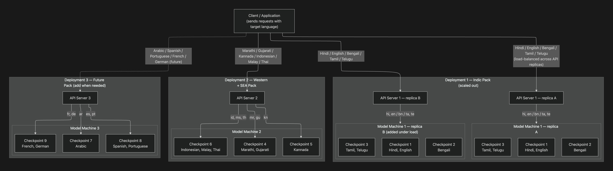

The multi-checkpoint pattern is how you deploy Pulse STT on-prem when you need more languages than a single checkpoint covers. Each deployment is a self-contained stack — one API server, one model server hosting up to three checkpoints — and deployments don't talk to each other. Scaling, failure isolation, and resource budgeting are all per-deployment.

## Why one API server per model server

Most multi-model serving designs centralize routing: a global load balancer keeps a registry of which checkpoint lives on which replica and forwards each request accordingly. That works, but the coordination overhead grows fast as checkpoints and replicas multiply, and a routing-layer bug can affect every deployment at once.

The multi-checkpoint pattern flips that: **routing across language families becomes the client's problem, but routing within a deployment is local and trivial.** The API server only knows about the checkpoints loaded into its own paired model server. There's no shared state, no global registry, and no cross-deployment hops. The blast radius of any change — config rollout, autoscaling, model swap — stays bounded to one deployment.

For most on-prem customers this is a better fit than centralized routing:

- Language packs ship and scale independently. The Indic pack can scale to 10 replicas during peak hours without touching the Western pack.
- A bad model rollout to Deployment 2 cannot break Deployment 1.
- Cost attribution is straightforward: each deployment's resources map to one set of languages.
- There is no global service to operate. The whole platform is N copies of the same simple two-container pattern.

## Architecture

<Frame caption="Multi-checkpoint deployment: one API server per model server, deployments isolated, client routes by target language">
  
</Frame>

The diagram shows three deployments serving different language families:

- **Deployment 1** (Indic Pack): Hindi, English, Bengali, Tamil, Telugu — horizontally scaled to two replicas under load. The client load-balances across `replica A` and `replica B`; each replica loads the same three checkpoints, so either can serve any Indic request.
- **Deployment 2** (Western + SEA Pack): Marathi, Gujarati, Kannada, Indonesian, Malay, Thai — single replica.
- **Deployment 3** (Future Pack): Arabic, Spanish, Portuguese, French, German — added when needed.

The language groupings are illustrative. Actual checkpoint composition is decided per training run based on model quality and GPU memory budget. A single checkpoint can serve multiple languages if it was trained that way (most Indic and EU checkpoints are multilingual), so three checkpoints can cover well more than three languages.

## What each deployment contains

Two containers, paired 1:1:

| Container | Image | Role |
|---|---|---|
| `asr` | the Pulse model server image | Loads up to three checkpoints into GPU memory. Serves gRPC/HTTP to the local API server only. |
| `api-server` | the Pulse API image | The entry point. Talks only to its paired `asr` container. Exposes the public REST + WebSocket transcription API. |

Two more containers are **shared across every deployment**:

| Container | Role |
|---|---|
| `license-proxy` | Validates the on-prem license. One instance per host or per cluster — every API server talks to it. |
| `redis` | Pub/sub for streaming responses + session coordination. One instance, shared. |

## Loading checkpoints — the `MODEL_URL` knob

The model image accepts a `MODEL_URL` environment variable as a comma-separated list of up to three checkpoint URLs. The container reads it on startup and **sizes its concurrency automatically** based on how many checkpoints it sees:

| Checkpoints loaded | Concurrency per checkpoint |
|---|---|
| 1 | 128 |
| 2 | 64 |
| 3 | 48 |

The total concurrency budget is approximately constant — the model server splits its GPU and memory roughly evenly across checkpoints. Loading three checkpoints does not give you 3× capacity; it gives you broader language coverage at the cost of per-checkpoint throughput. Plan checkpoint composition with that tradeoff in mind: rare-language checkpoints can share a deployment; high-traffic ones should get their own.

## Routing — split responsibility

Routing happens in two places:

**Inside a deployment (we handle).** When a request comes in tagged with a target language, the API server looks at what's loaded on its paired model server and picks the right checkpoint. If a dedicated checkpoint exists for that language, it goes there. If not, the request falls back to a multilingual checkpoint that covers the language. The client just specifies `language=hi` and gets routed correctly inside Deployment 1.

**Across deployments (the client handles).** Each deployment exposes its own URL. The client must know which deployment serves which languages and forward each request accordingly. There's no cross-deployment routing layer — by design.

A minimal Python router looks like this:

```python
DEPLOYMENT_ROUTES = {
    # Indic Pack — Deployment 1
    "hi": "https://api-d1.smallest.ai",
    "en": "https://api-d1.smallest.ai",
    "bn": "https://api-d1.smallest.ai",
    "ta": "https://api-d1.smallest.ai",
    "te": "https://api-d1.smallest.ai",
    # Western + SEA Pack — Deployment 2
    "mr": "https://api-d2.smallest.ai",
    "gu": "https://api-d2.smallest.ai",
    "kn": "https://api-d2.smallest.ai",
    "id": "https://api-d2.smallest.ai",
    "ms": "https://api-d2.smallest.ai",
    "th": "https://api-d2.smallest.ai",
}

def transcribe(audio: bytes, language: str):
    url = DEPLOYMENT_ROUTES[language]
    return requests.post(f"{url}/waves/v1/pulse/get_text",
                         params={"language": language},
                         data=audio,
                         headers={"Content-Type": "application/octet-stream"})
```

For production you'd typically put a small dispatcher service or an API-gateway routing rule in front of this map. The point is: the routing logic is **a flat dict**, not a service that needs to track replica health or do consistent hashing.

## docker-compose.yml — two-deployment reference

This is the minimum config to run two independent deployments on a single host. To add a third, duplicate the `asr-N` + `api-server-N` pair with new service names and host ports.

```yaml
# docker-compose.yml — two deployments sharing license-proxy + redis.
#
# Pattern:
#   - Each deployment = 1 `asr` (model) + 1 `api-server`, paired 1:1
#   - `license-proxy` and `redis` are shared across every deployment
#   - To add deployment N: duplicate `asr-N` + `api-server-N` with new
#     service names and host ports
#
# MODEL_URL accepts up to 3 comma-separated checkpoint URLs.
# Concurrency auto-splits per model container:
#   1 ckpt -> 128  |  2 ckpts -> 64 each  |  3 ckpts -> 48 each

version: '3.8'

services:

  # ─── Shared infrastructure ───────────────────────────────────────

  license-proxy:
    image: quay.io/smallestinc/license-proxy:latest
    container_name: license-proxy
    environment:
      - LICENSE_KEY=${LICENSE_KEY}
    networks: [kraken-network]
    restart: unless-stopped

  redis:
    image: redis:latest
    ports: ["6379:6379"]
    command: redis-server --client-output-buffer-limit "pubsub 256mb 128mb 300"
    networks: [kraken-network]
    restart: unless-stopped
    healthcheck:
      test: ["CMD", "redis-cli", "ping"]
      interval: 5s
      timeout: 3s
      retries: 5

  # ─── Deployment 1 ────────────────────────────────────────────────

  asr:
    image: asr_image          # replace with your tagged build
    ports:
      - "2233:2233"
      - "9090:9090"
    environment:
      - LICENSE_KEY=${LICENSE_KEY}
      - PORT=2233
      # Single checkpoint (multilingual EU pack):
      - MODEL_URL=https://onprem-public-models.s3.ap-south-1.amazonaws.com/asr/pulse_batch_multi_eu_dr_pccpi_140326.smlst
      # Multi-checkpoint (max 3, comma-separated):
      # - MODEL_URL=https://.../pulse_batch_multi_eu_dr_pccpi_140326.smlst,https://.../pulse_streaming_hi_en_dr_pccpii_090326.smlst
      - REDIS_URL=redis://redis:6379
      - PYTORCH_CUDA_ALLOC_CONF=expandable_segments:True
    deploy:
      resources:
        reservations:
          devices:
            - { driver: nvidia, count: 1, capabilities: [gpu] }
    volumes:
      - ./models:/smallest/models
    networks: [kraken-network]
    restart: unless-stopped
    depends_on:
      redis: { condition: service_healthy }

  api-server:
    image: api_server_image   # replace with your tagged build
    container_name: api-server
    ports: ["7100:7100"]
    environment:
      - LICENSE_KEY=${LICENSE_KEY}
      - ASR_BASE_URL=http://asr:2233
      - ASR_STREAMING_BASE_URL=http://asr:2233
      - LIGHTNING_ASR_BASE_URL=http://asr:2233
      - LIGHTNING_ASR_STREAMING_BASE_URL=http://asr:2233
      - API_BASE_URL=http://license-proxy:6699
      - REDIS_HOST=redis
    networks: [kraken-network]
    restart: unless-stopped
    depends_on:
      - license-proxy
      - redis

  # ─── Deployment 2 — same pattern, different ports + checkpoints ───

  asr-2:
    image: asr_image
    ports:
      - "2234:2233"           # different host port
      - "9091:9090"
    environment:
      - LICENSE_KEY=${LICENSE_KEY}
      - PORT=2233
      - MODEL_URL=https://.../checkpoint_mr_gu.smlst,https://.../checkpoint_kn.smlst
      - REDIS_URL=redis://redis:6379
      - PYTORCH_CUDA_ALLOC_CONF=expandable_segments:True
    deploy:
      resources:
        reservations:
          devices:
            - { driver: nvidia, count: 1, capabilities: [gpu] }
    volumes:
      - ./models:/smallest/models
    networks: [kraken-network]
    restart: unless-stopped
    depends_on:
      redis: { condition: service_healthy }

  api-server-2:
    image: api_server_image
    container_name: api-server-2
    ports: ["7101:7100"]      # different host port
    environment:
      - LICENSE_KEY=${LICENSE_KEY}
      - ASR_BASE_URL=http://asr-2:2233       # points to ITS OWN model
      - ASR_STREAMING_BASE_URL=http://asr-2:2233
      - LIGHTNING_ASR_BASE_URL=http://asr-2:2233
      - LIGHTNING_ASR_STREAMING_BASE_URL=http://asr-2:2233
      - API_BASE_URL=http://license-proxy:6699   # shared
      - REDIS_HOST=redis                          # shared
    networks: [kraken-network]
    restart: unless-stopped
    depends_on:
      - license-proxy
      - redis

networks:
  kraken-network:
    driver: bridge
    name: kraken-network
```

A few details worth calling out:

- **Each `api-server-N` has its own `ASR_BASE_URL` pointing at its paired `asr-N`.** This is the single most important line — getting it wrong (e.g. pointing `api-server-2` at `asr` instead of `asr-2`) is the most common misconfiguration.
- **`PYTORCH_CUDA_ALLOC_CONF=expandable_segments:True`** keeps GPU memory fragmentation in check when loading multiple checkpoints. Leave it on.
- **`license-proxy` and `redis` are shared, not duplicated.** Spinning up extra copies adds cost without benefit; they're not on the per-request hot path.
- **Host ports differ per deployment** (`7100`, `7101`, …). The internal container port `7100` stays the same; only the published port changes.

## Request flow

1. The client looks up the target language in its routing map and selects the deployment URL (`api-d1.smallest.ai` for Hindi, `api-d2.smallest.ai` for Marathi, etc.).
2. The request hits that deployment's `api-server`, carrying the `language` parameter (and any other Pulse STT options — `word_timestamps`, `diarize`, `keywords`, etc.).
3. The API server forwards to its paired model server (`asr:2233`). If a dedicated checkpoint for the requested language is loaded, the request goes there. If not, it falls back to a multilingual checkpoint that covers the language.
4. The model server runs inference and streams the transcript back. For REST, the API server buffers and returns one response; for the WebSocket endpoint, partials stream as they're produced.

No cross-deployment hops, no global checkpoint registry, no shared cache that needs to know which model is loaded where.

## Scaling

Each deployment scales independently. Triggers are local:

- A traffic spike on Deployment 1 (Indic) scales up `asr` and `api-server` replicas using that deployment's own HPA / autoscaler rules. Deployment 2 (Western + SEA) is completely unaffected — its replica count, GPU cost, and capacity stay exactly as they were.
- Every model replica in a deployment loads the **same** set of checkpoints, so any API replica in front of them can serve any request. Load balancing is round-robin or least-connections; no checkpoint-aware routing required.
- Adding a new language family is a new deployment, not a redeploy of the existing one. Deployment 3 (Future Pack in the diagram) goes from zero to serving traffic without touching Deployments 1 or 2.

If a single checkpoint's traffic outgrows what a 3-checkpoint deployment can serve at 48 concurrency each, the standard move is to give it its own deployment with a single checkpoint loaded (concurrency goes back to 128). That's a config change — same image, different `MODEL_URL`.

## Adding a new deployment

1. Duplicate the `asr-N` + `api-server-N` pair in `docker-compose.yml`. Pick new host ports (e.g. `7102`, `2235`) and a new service name suffix.
2. Set `MODEL_URL` on the new `asr-N` to the checkpoint(s) you want it to serve.
3. Point the new `api-server-N`'s `ASR_*_BASE_URL` variables at the new `asr-N` service (not at `asr`).
4. `docker compose up -d asr-N api-server-N`.
5. Add the new languages to your client's routing map. The new deployment is live.

`license-proxy` and `redis` keep running as-is. No restart of existing deployments is required.

## Common pitfalls

- **`api-server-N` pointing at the wrong `asr`.** Symptom: requests succeed but always come back with the wrong language transcript, or a language you didn't load. Fix: re-check `ASR_BASE_URL` and friends — they must match the paired `asr-N`.
- **Loading 3 checkpoints when you only need 1.** Symptom: lower per-request throughput than expected. Fix: drop down to 1 checkpoint if all your traffic is one language family; the concurrency budget triples.
- **Treating `license-proxy` as a per-deployment service.** It isn't. One instance, every API server connects to it. Running multiple wastes resources and complicates license accounting.
- **Forgetting that `MODEL_URL` is a startup-only knob.** The list is read once at container boot. Hot-reloading checkpoints requires restarting the `asr` container.

## Related

- [Quick start](/waves/self-host/docker-setup/stt-deployment/quick-start) — minimum single-deployment setup
- [Configuration reference](/waves/self-host/docker-setup/stt-deployment/configuration) — all environment variables documented
- [Troubleshooting](/waves/self-host/docker-setup/stt-deployment/troubleshooting) — common deploy issues
