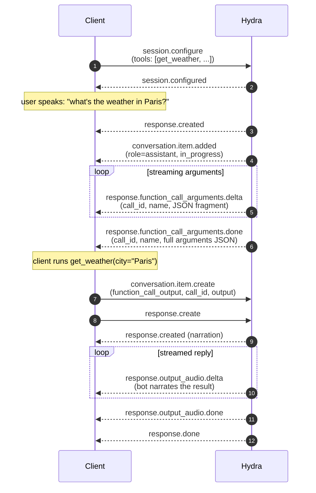

Hydra is a voice model — it doesn't execute tools. The client declares tool schemas in `session.configure`, Hydra decides when to call them and streams the arguments JSON, and the client executes the tool locally and posts the result back.

## Event flow



## Declare tools

`tools` is a `session.configure` field. Each entry is a JSON Schema for a function the model may call.

```json
{
  "type": "session.configure",
  "session": {
    "instructions": "You are a weather assistant. Use get_weather when asked.",
    "voice": "leda",
    "tools": [
      {
        "type": "function",
        "name": "get_weather",
        "description": "Look up current weather for a city.",
        "parameters": {
          "type": "object",
          "properties": { "city": { "type": "string" } },
          "required": ["city"]
        }
      }
    ]
  }
}
```

You can also add or replace `tools` mid-session via `session.update` — see [Managing sessions](/waves/documentation/speech-to-speech-hydra/managing-sessions#mid-session-updates).

## Execute the tool and post the result

When you receive `response.function_call_arguments.done`, parse the JSON, run your tool, and post the result back as a `function_call_output` item.

```python
async for raw in ws:
    evt = json.loads(raw)

    if evt["type"] == "response.function_call_arguments.done":
        args = json.loads(evt["arguments"])
        result = run_tool(evt["name"], args)

        await ws.send(json.dumps({
            "type": "conversation.item.create",
            "item": {
                "type": "function_call_output",
                "call_id": evt["call_id"],
                "output": result if isinstance(result, str) else json.dumps(result),
            },
        }))
        # See "Multi-tool turns" below — don't send response.create here directly.
        schedule_response_create()
```

After posting the tool output, you need to send a single `response.create` to tell Hydra to narrate the result. The next section explains the gotcha.

## Single-tool vs multi-tool turns

If the model calls one tool, the obvious code works: post the output, send `response.create`, done.

If the model calls **multiple tools in one turn**, the obvious code is wrong. The server emits one `response.function_call_arguments.done` per call, and if you send `response.create` after each one, the model starts narrating before all results are in — you get a half-formed answer.

**Solution: debounce `response.create`.** Only fire one, ~200 ms after the last tool output.

```python
import asyncio, json

pending_create: asyncio.Task | None = None
DEBOUNCE_MS = 200

async def _send_response_create():
    await asyncio.sleep(DEBOUNCE_MS / 1000)
    await ws.send(json.dumps({"type": "response.create"}))

def schedule_response_create():
    global pending_create
    if pending_create and not pending_create.done():
        pending_create.cancel()
    pending_create = asyncio.create_task(_send_response_create())
```

For single-tool turns the debounce adds 200 ms — well below the model's own time-to-first-audio, so users won't notice.

## Streaming arguments

The model emits arguments as a stream of JSON fragments. If you want to act on each token as it arrives (rare for tool args, common for showing a "thinking" UI), concatenate `delta` strings per `call_id`:

```python
args_buf: dict[str, str] = {}

if evt["type"] == "response.function_call_arguments.delta":
    args_buf.setdefault(evt["call_id"], "")
    args_buf[evt["call_id"]] += evt.get("delta", "")
```

The `done` event gives you the full string under `arguments` either way — so most clients just wait for `done` and parse once.

## Tool response timeout

If you declare tools but don't post `function_call_output` + `response.create` within the server's timeout window, you get an error and the turn is abandoned:

```json
{ "type": "error", "error": { "code": "tool_response_timeout", "type": "..." } }
```

Common causes: a long-running tool with no async dispatch, network call to your own backend that hangs, or forgetting to send `response.create` after the output.

<Tip>
**Long-running tools.** Tools that take more than a few seconds should return a synchronous "working on it" output immediately and emit real results as a follow-up message via a fresh `conversation.item.create`. This keeps Hydra responsive — the assistant acknowledges the request out loud while the actual work happens, instead of waiting silently and risking a `tool_response_timeout`.
</Tip>

## Common gotchas

- **One `response.create` per turn, not per tool.** Multi-tool turns require debounce. The model decides when to call multiple tools — your client decides when to request narration.
- **Tools execute on your side, not Hydra's.** Hydra streams arguments; you run the code. Same model as the OpenAI Realtime API.
- **Unknown tool names are accepted in the schema, then never called.** If the model isn't calling your tool, double-check that the `name` in `session.configure` matches the user prompt's intent.

## Next

- [Prompting voice agents](/waves/documentation/speech-to-speech-hydra/prompting) — phrasing `instructions` so the model reliably calls tools
- [Errors & reconnection](/waves/documentation/speech-to-speech-hydra/errors) — `tool_response_timeout` and other failure modes
