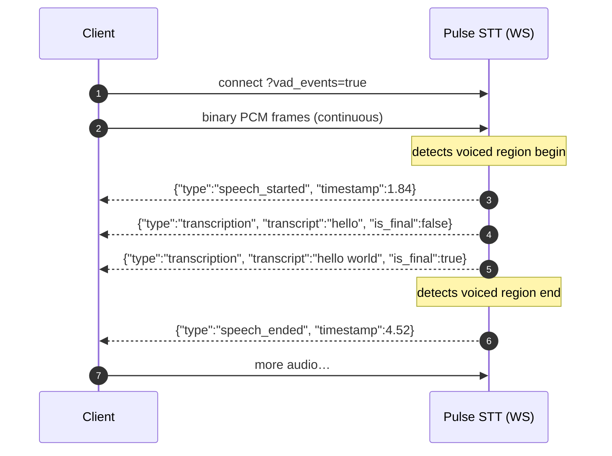

<Badge color="purple">Real-Time</Badge>

With one query parameter set, the Pulse STT WebSocket also emits acoustic voice-activity events — `speech_started` and `speech_ended` — interleaved with the normal `transcription` messages on the same connection. Boundaries are derived from the audio itself, independent of transcript finalization.

VAD events are **streaming only** (WebSocket). The pre-recorded REST endpoint is unaffected.

## Enabling VAD events

Add `vad_events=true` to your WebSocket connection query string. Default is `false` — existing integrations stay transcripts-only.

```javascript
const url = new URL("wss://api.smallest.ai/waves/v1/stt/live?model=pulse");
url.searchParams.append("language", "en");
url.searchParams.append("encoding", "linear16");
url.searchParams.append("sample_rate", "16000");
url.searchParams.append("vad_events", "true");

const ws = new WebSocket(url.toString(), {
  headers: { Authorization: `Bearer ${API_KEY}` },
});
```

The alias `vad=true` works too. If both are set, `vad_events` wins.

## How it flows



Boundaries are **acoustic**, not lexical — they're computed directly from the audio, so they don't line up exactly with `is_final` transcript turns. That's expected.

## Event payloads

Two new message types are interleaved with the normal `transcription` stream. Discriminate by the `type` field.

### `speech_started`

Emitted the moment speech is detected after silence.

```json
{
  "type": "speech_started",
  "session_id": "a1b2c3d4",
  "timestamp": 1.84
}
```

### `speech_ended`

Emitted after a run of silence following speech.

```json
{
  "type": "speech_ended",
  "session_id": "a1b2c3d4",
  "timestamp": 4.52
}
```

| Field | Type | Description |
|---|---|---|
| `type` | string | `speech_started` or `speech_ended` — the message-type discriminator. |
| `session_id` | string | Same session identifier returned on every `transcription` message — use it to correlate VAD events with transcript turns when multiplexing. |
| `timestamp` | number | Seconds from the first audio frame you sent on this connection. |

## Handling the events

Switch on `type` so VAD events route to your speaking-indicator logic while transcript messages flow through your existing handler unchanged.

```javascript
ws.onmessage = (e) => {
  const m = JSON.parse(e.data);
  switch (m.type) {
    case "speech_started":
      onSpeechStart(m.timestamp);
      break;
    case "speech_ended":
      onSpeechEnd(m.timestamp);
      break;
    case "transcription":
    default:
      handleTranscript(m);   // your existing path
      break;
  }
};
```

```python
import json

async for raw in ws:
    m = json.loads(raw)
    t = m.get("type")
    if t == "speech_started":
        print(f"▶ speech_started @ {m['timestamp']:.2f}s")
    elif t == "speech_ended":
        print(f"■ speech_ended   @ {m['timestamp']:.2f}s")
    else:
        # existing transcription handling
        ...
```

## Good to know

- **Opt-in.** Without `vad_events=true`, nothing changes — you keep getting transcripts only. Existing integrations are unaffected.
- **Acoustic, not lexical.** Boundaries are derived from the audio, independent of transcript finalization (`is_final`), so they won't line up exactly with words.
- **`speech_ended` requires trailing silence.** The event fires when the model detects a run of silence after speech. If a connection closes with the speaker still mid-utterance — for example you call `close_stream` immediately at the end of an audio file — no trailing silence is observed and no `speech_ended` is emitted for that final region. To force the event at the end of a file, append a short pad (≈1 s) of zero-valued PCM before closing.
- **Timestamps** are seconds from the first audio frame you sent on this connection.
- **Match the sample rate.** Keep the `sample_rate` query param equal to the rate of the PCM you send, or both transcripts and event timing will drift.
- **Tuning is not client-configurable.** Sensitivity threshold and debounce are model defaults; there are no `vad_threshold` / `vad_debounce` knobs.
