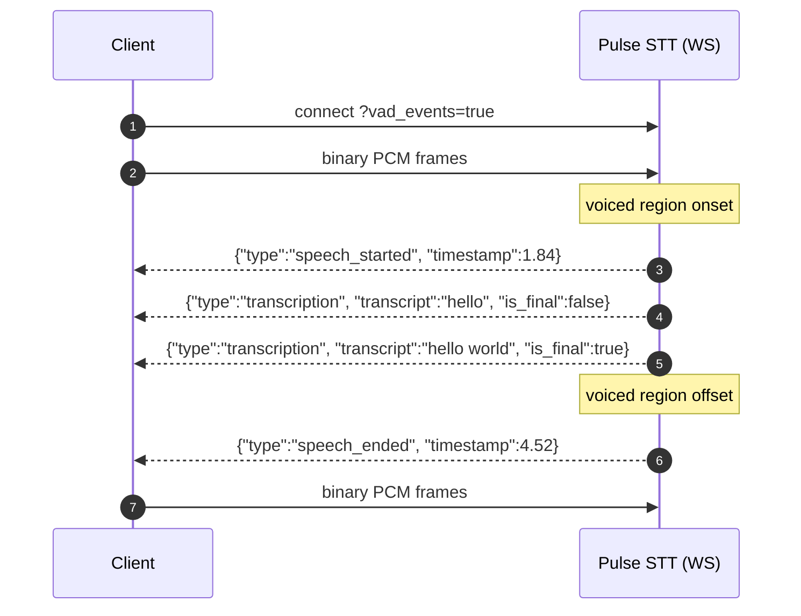

<Badge color="purple">Real-Time</Badge>

When `vad_events=true` is set on the WebSocket connection, the Pulse STT server emits two additional JSON message types: `speech_started` and `speech_ended`. They are interleaved with the `transcription` stream on the same socket. Event boundaries are derived from the audio signal and are independent of transcript finalization.

VAD events are **WebSocket only**. The pre-recorded REST endpoint does not emit them.

## Enabling

Set `vad_events=true` on the WebSocket URL. Default is `false`.

```javascript
const url = new URL("wss://api.smallest.ai/waves/v1/stt/live?model=pulse");
url.searchParams.append("language", "en");
url.searchParams.append("encoding", "linear16");
url.searchParams.append("sample_rate", "16000");
url.searchParams.append("vad_events", "true");

const ws = new WebSocket(url.toString(), {
  headers: { Authorization: `Bearer ${API_KEY}` },
});
```

`vad=true` is accepted as an alias. When both are set, `vad_events` takes precedence and `vad` is ignored.

## Message sequence



Boundaries are acoustic, not lexical. They are computed from the audio signal independently of transcript finalization, so they do not coincide with `is_final` transcript turns.

## Event payloads

The two message types are interleaved with `transcription` messages on the same socket. Discriminate on the `type` field.

### `speech_started`

Emitted when speech onset is detected after silence.

```json
{
  "type": "speech_started",
  "session_id": "a1b2c3d4",
  "timestamp": 1.84
}
```

### `speech_ended`

Emitted when a voiced region ends and silence is detected.

```json
{
  "type": "speech_ended",
  "session_id": "a1b2c3d4",
  "timestamp": 4.52
}
```

| Field | Type | Description |
|---|---|---|
| `type` | string | Message-type discriminator. One of `speech_started`, `speech_ended`. |
| `session_id` | string | Session identifier. Matches the `session_id` returned on `transcription` messages from the same connection. |
| `timestamp` | number | Seconds, measured from the first audio frame received on the connection. |

## Handling

Discriminate on the `type` field. `transcription` messages route through the default branch unchanged.

```javascript
ws.onmessage = (e) => {
  const m = JSON.parse(e.data);
  switch (m.type) {
    case "speech_started":
      onSpeechStart(m.timestamp);
      break;
    case "speech_ended":
      onSpeechEnd(m.timestamp);
      break;
    case "transcription":
    default:
      handleTranscript(m);
      break;
  }
};
```

```python
import json

async for raw in ws:
    m = json.loads(raw)
    t = m.get("type")
    if t == "speech_started":
        on_speech_start(m["timestamp"])
    elif t == "speech_ended":
        on_speech_end(m["timestamp"])
    else:
        handle_transcript(m)
```

## Tuning

Three optional query parameters tune the acoustic VAD. All are shared with [`endpointing`](/waves/documentation/speech-to-text-pulse/features/endpointing) when that is also enabled (both features run on the same VAD instance).

| Parameter | Range | Default | Effect |
|---|---|---|---|
| `endpointing_timeout` | 0-10000 ms | `300` | Trailing silence window before `speech_ended` fires. Larger values wait longer between utterances before reporting the end of speech. |
| `vad_threshold` | 0-1 | `0.5` | Speech probability threshold. Higher values require more confidence before reporting voiced audio (fewer false starts on background noise, at the cost of missing very soft speech). |
| `vad_min_speech_ms` | integer ms | `120` | Minimum contiguous voiced audio before `speech_started` fires. Higher values debounce brief transients (coughs, keystrokes). |

Example with tuning:

```javascript
const url = new URL("wss://api.smallest.ai/waves/v1/stt/live?model=pulse");
url.searchParams.append("language", "en");
url.searchParams.append("encoding", "linear16");
url.searchParams.append("sample_rate", "16000");
url.searchParams.append("vad_events", "true");
url.searchParams.append("endpointing_timeout", "500");
url.searchParams.append("vad_threshold", "0.6");
url.searchParams.append("vad_min_speech_ms", "200");
```

## Notes

- **Opt-in.** When `vad_events` is unset or `false`, the connection emits only `transcription` messages.
- **Acoustic, not lexical.** Boundaries are derived from the audio signal, independent of `is_final`. They do not coincide with word boundaries.
- **`speech_ended` requires trailing silence.** The event fires after `endpointing_timeout` ms of silence following a voiced region. If the connection closes while the audio still contains voiced energy, no `speech_ended` is emitted for the final voiced region. To force emission at the end of a finite audio file, append a short pad (about 1 second) of zero-valued PCM before sending `close_stream`.
- **`timestamp`** is measured in seconds from the first audio frame received on the connection.
- **Sample rate.** The `sample_rate` query parameter must equal the rate of the PCM frames sent on the connection. Mismatch causes timing drift on both transcripts and VAD timestamps.
- **Shared with `endpointing`.** The three tuning parameters above apply to `endpointing` too. When both `vad_events` and `endpointing` are enabled, they use the same VAD instance and the same silence window.
