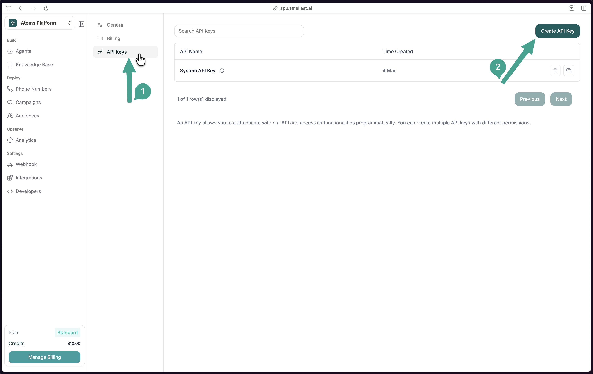
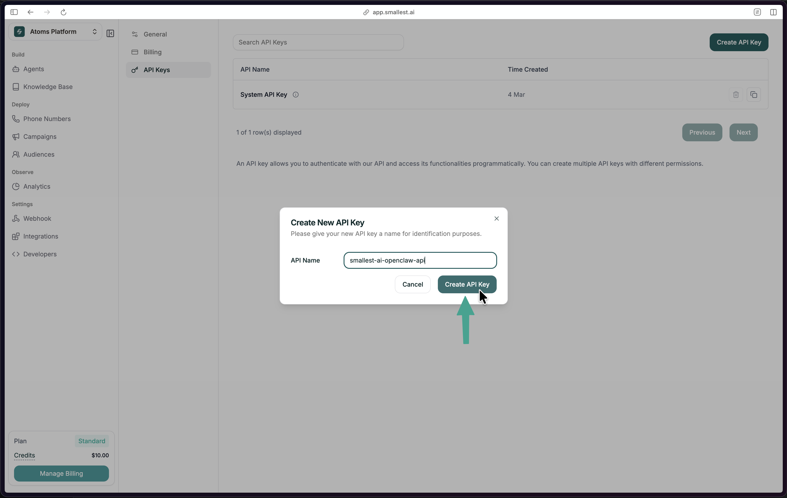

## Step 1: Get Your API Key

In the [Smallest AI Console](https://app.smallest.ai/dashboard/settings/apikeys?utm_source=documentation&utm_medium=speech-to-text), go to **Settings → API Keys** and click **Create API Key**.





Copy the key and export it:

```bash
export SMALLEST_API_KEY="your-api-key-here"
```

<Tip>New to Smallest AI? [Sign up here](https://app.smallest.ai?utm_source=documentation&utm_medium=speech-to-text) first.</Tip>

## Step 2: Transcribe Audio

Here's the sample audio we'll transcribe:

<audio controls style={{ width: '100%', maxWidth: '500px' }}>
  <source src="../../audio/stt-sample-audio.wav" type="audio/wav" />
  Your browser does not support the audio element.
</audio>

First, generate a test audio file (or use any WAV file you have):

```bash
curl -X POST "https://api.smallest.ai/waves/v1/lightning-v3.1/get_speech" \
  -H "Authorization: Bearer $SMALLEST_API_KEY" \
  -H "Content-Type: application/json" \
  -d '{"text": "Hello from Smallest AI.", "voice_id": "magnus", "sample_rate": 24000, "output_format": "wav"}' \
  --output audio.wav
```

Now transcribe it:

```bash
curl -X POST "https://api.smallest.ai/waves/v1/pulse/get_text?language=en" \
  -H "Authorization: Bearer $SMALLEST_API_KEY" \
  -H "Content-Type: audio/wav" \
  --data-binary @audio.wav
```

You'll get back:

```json
{
  "status": "success",
  "transcription": "Hello from smallest AI!"
}
```

## Step 3: Build It Into Your App

<CodeGroup>

```bash cURL (file upload)
curl -X POST "https://api.smallest.ai/waves/v1/pulse/get_text?language=en" \
  -H "Authorization: Bearer $SMALLEST_API_KEY" \
  -H "Content-Type: audio/wav" \
  --data-binary "@audio.wav"
```

```python Python
import os
import requests

API_KEY = os.environ["SMALLEST_API_KEY"]

response = requests.post(
    "https://api.smallest.ai/waves/v1/pulse/get_text",
    params={"language": "en"},
    headers={
        "Authorization": f"Bearer {API_KEY}",
        "Content-Type": "audio/wav",
    },
    data=open("audio.wav", "rb").read(),
    timeout=120,
)

result = response.json()
print(result["transcription"])
```

```javascript JavaScript
const fs = require("fs");

const audioData = fs.readFileSync("audio.wav");

const params = new URLSearchParams({ language: "en" });
const response = await fetch(
  `https://api.smallest.ai/waves/v1/pulse/get_text?${params}`,
  {
    method: "POST",
    headers: {
      Authorization: `Bearer ${process.env.SMALLEST_API_KEY}`,
      "Content-Type": "audio/wav",
    },
    body: audioData,
  }
);

const result = await response.json();
console.log(result.transcription);
```

</CodeGroup>

## Step 4: Explore Features

<CardGroup cols={2}>
  <Card title="Real-Time Transcription" icon="broadcast-tower" href="/waves/documentation/speech-to-text-pulse/realtime-web-socket/quickstart">
    Stream audio via WebSocket for live transcription.
  </Card>
  <Card title="Speaker Diarization" icon="users" href="/waves/documentation/speech-to-text-pulse/features/diarization">
    Identify and label different speakers.
  </Card>
  <Card title="Word Timestamps" icon="clock" href="/waves/documentation/speech-to-text-pulse/features/word-timestamps">
    Precise timing for each transcribed word.
  </Card>
  <Card title="Emotion Detection" icon="face-smile" href="/waves/documentation/speech-to-text-pulse/features/emotion-detection">
    Analyze emotional tone in speech.
  </Card>
</CardGroup>

Full endpoint spec: [Pulse API Reference](/waves/api-reference)

## Need Help?

<Card title="Join Discord" icon="fa-brands fa-discord" href="https://discord.gg/5evETqguJs">
  Ask questions and get help from the community.
</Card>

Or email [support@smallest.ai](mailto:support@smallest.ai).
