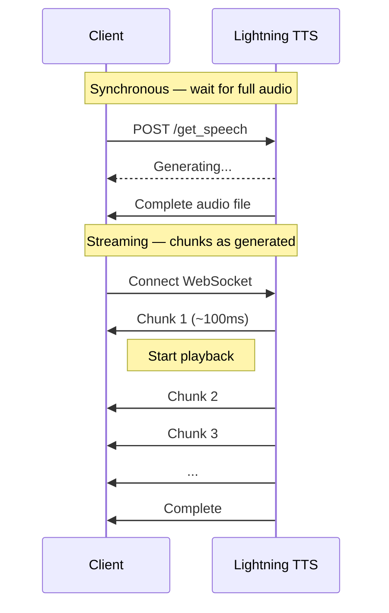

Streaming TTS delivers audio chunks as they're generated — playback starts immediately instead of waiting for the full file. First chunk arrives in ~100ms.

**Streamed audio output:**

<audio controls style={{ width: '100%', maxWidth: '500px' }}>
  <source src="../../audio/tts-sample-hello.wav" type="audio/wav" />
  Your browser does not support the audio element.
</audio>



## WebSocket Streaming

Persistent connections for continuous, low-latency audio. Best for conversational AI and real-time apps.

**Endpoint:** `wss://api.smallest.ai/waves/v1/lightning-v3.1/get_speech/stream`

<CodeGroup>

```python Python
import asyncio
import json
import base64
import wave
import os
import websockets

API_KEY = os.environ["SMALLEST_API_KEY"]
WS_URL = "wss://api.smallest.ai/waves/v1/lightning-v3.1/get_speech/stream"

async def stream_tts(text):
    audio_chunks = []

    async with websockets.connect(
        WS_URL,
        extra_headers={"Authorization": f"Bearer {API_KEY}"},
    ) as ws:
        await ws.send(json.dumps({
            "text": text,
            "voice_id": "magnus",
            "sample_rate": 24000,
        }))

        while True:
            response = await ws.recv()
            data = json.loads(response)

            if data["status"] == "chunk":
                audio = base64.b64decode(data["data"]["audio"])
                audio_chunks.append(audio)
            elif data["status"] == "complete":
                break

    # Save as WAV
    raw = b"".join(audio_chunks)
    with wave.open("streamed.wav", "wb") as wf:
        wf.setnchannels(1)
        wf.setsampwidth(2)
        wf.setframerate(24000)
        wf.writeframes(raw)

    print(f"Saved streamed.wav ({len(audio_chunks)} chunks)")

asyncio.run(stream_tts("Streaming delivers audio in real-time for voice assistants and chatbots."))
```

```javascript JavaScript
const WebSocket = require("ws");
const fs = require("fs");

const API_KEY = process.env.SMALLEST_API_KEY;

const ws = new WebSocket(
  "wss://api.smallest.ai/waves/v1/lightning-v3.1/get_speech/stream",
  { headers: { Authorization: `Bearer ${API_KEY}` } }
);

const audioChunks = [];

ws.on("open", () => {
  ws.send(JSON.stringify({
    text: "Streaming delivers audio in real-time for voice assistants and chatbots.",
    voice_id: "magnus",
    sample_rate: 24000,
  }));
});

ws.on("message", (raw) => {
  const data = JSON.parse(raw);

  if (data.status === "chunk") {
    audioChunks.push(Buffer.from(data.data.audio, "base64"));
  } else if (data.status === "complete") {
    const audio = Buffer.concat(audioChunks);
    // Add WAV header and save
    fs.writeFileSync("streamed.pcm", audio);
    console.log(`Saved streamed.pcm (${audioChunks.length} chunks)`);
    ws.close();
  }
});
```

```python Python SDK
from smallestai.waves import TTSConfig, WavesStreamingTTS
import wave

config = TTSConfig(
    voice_id="magnus",
    api_key="YOUR_SMALLEST_API_KEY",
    sample_rate=24000,
    speed=1.0,
    max_buffer_flush_ms=100,
)

streaming_tts = WavesStreamingTTS(config)

text = "Streaming delivers audio in real-time for voice assistants and chatbots."
audio_chunks = list(streaming_tts.synthesize(text))

with wave.open("streamed.wav", "wb") as wf:
    wf.setnchannels(1)
    wf.setsampwidth(2)
    wf.setframerate(24000)
    wf.writeframes(b"".join(audio_chunks))
```

</CodeGroup>

## SSE Streaming

Server-Sent Events over HTTP — simpler to set up, no persistent connection needed.

**Endpoint:** `POST https://api.smallest.ai/waves/v1/lightning-v3.1/stream`

<CodeGroup>

```python Python
import os
import json
import base64
import wave
import requests

API_KEY = os.environ["SMALLEST_API_KEY"]

response = requests.post(
    "https://api.smallest.ai/waves/v1/lightning-v3.1/stream",
    headers={
        "Authorization": f"Bearer {API_KEY}",
        "Content-Type": "application/json",
        "Accept": "text/event-stream",
    },
    json={
        "text": "SSE streaming is simpler to set up than WebSocket.",
        "voice_id": "magnus",
        "sample_rate": 24000,
    },
    stream=True,
)

audio_chunks = []
for line in response.iter_lines():
    if not line:
        continue
    line = line.decode()
    if not line.startswith("data: "):
        continue

    data = json.loads(line[6:])
    if data["status"] == "chunk":
        audio_chunks.append(base64.b64decode(data["data"]["audio"]))
    elif data["status"] == "complete":
        break

raw = b"".join(audio_chunks)
with wave.open("sse_output.wav", "wb") as wf:
    wf.setnchannels(1)
    wf.setsampwidth(2)
    wf.setframerate(24000)
    wf.writeframes(raw)
```

```bash cURL
curl -N -X POST "https://api.smallest.ai/waves/v1/lightning-v3.1/stream" \
  -H "Authorization: Bearer $SMALLEST_API_KEY" \
  -H "Content-Type: application/json" \
  -H "Accept: text/event-stream" \
  -d '{
    "text": "SSE streaming is simpler to set up than WebSocket.",
    "voice_id": "magnus",
    "sample_rate": 24000
  }'
```

</CodeGroup>

## Streaming Text Input (SDK)

For real-time applications where text arrives incrementally (e.g., from an LLM), the SDK supports streaming text input:

```python
from smallestai.waves import TTSConfig, WavesStreamingTTS

config = TTSConfig(voice_id="magnus", api_key="YOUR_API_KEY", sample_rate=24000)
streaming_tts = WavesStreamingTTS(config)

def text_stream():
    """Simulates text arriving word by word (e.g., from an LLM)."""
    text = "Streaming synthesis with chunked text input."
    for word in text.split():
        yield word + " "

audio_chunks = []
for chunk in streaming_tts.synthesize_streaming(text_stream()):
    audio_chunks.append(chunk)
    # In a real app, play each chunk immediately
```

## WebSocket vs SSE

| | WebSocket | SSE |
|---|---|---|
| **Connection** | Persistent, bidirectional | New HTTP request each time |
| **Multiple messages** | Reuse same connection | New request per message |
| **Best for** | Voice assistants, chatbots | Simple one-off streaming |
| **Latency** | Lowest (no reconnect overhead) | Slightly higher |
| **Concurrency** | Up to 5 connections per unit | Per-request |

<Tip>
Use **WebSocket** when sending multiple TTS requests over time (conversations, voice bots). Use **SSE** for simple one-shot streaming where you don't need a persistent connection.
</Tip>

## Response Format

Each WebSocket/SSE message is JSON:

**Audio chunk:**
```json
{
  "status": "chunk",
  "data": { "audio": "base64_encoded_pcm_data" }
}
```

**Stream complete:**
```json
{
  "status": "complete",
  "message": "All chunks sent",
  "done": true
}
```

## Configuration Parameters

| Parameter | Default | Description |
|-----------|---------|-------------|
| `voice_id` | *required* | Voice identifier |
| `sample_rate` | `44100` | Audio sample rate (8000–44100 Hz) |
| `speed` | `1.0` | Speech speed (0.5–2.0) |
| `language` | `auto` | Language code |
| `output_format` | `pcm` | `pcm`, `mp3`, `wav`, or `mulaw` |

For concurrency limits and connection management, see [Concurrency and Limits](/waves/documentation/api-references/concurrency-and-limits).
