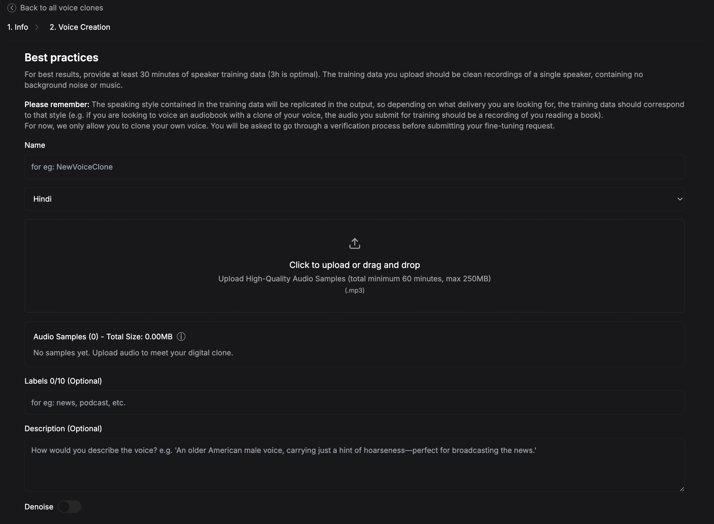

Professional voice cloning uses 45+ minutes of high-quality audio to train a custom voice model with studio-grade fidelity.

# Creating a Professional Voice Clone

1. **Go to the Smallest AI Platform**
   Navigate to the [platform](https://app.smallest.ai/waves/voice-cloning?utm_source=documentation&utm_medium=voice-cloning) and click on **Create New**. In the modal that appears, select **Professional Voice Clone**. This will direct you to the setup page:

   

2. **Upload Your Audio File**
   Follow the instructions provided on the page to upload your audio file. Ensure that the recording is clear for the best results.

3. **Enable Denoise (Optional)**
   If your audio contains background noise, toggle **Denoise** on to improve quality.

4. **Wait for Model to get trained**
   The voice cloning process typically takes **3 to 6 hours**, but may take longer depending on demand. The Voice Clone will be available to Use on platform and you will also get mail for that.

### **Note:**
**Creation of Professional Voice Clones (PVC) is not available via the SDK** due to the requirement of larger audio files. Please use the Smallest AI platform for this process.

If you have any questions or run into any issues, our community is here to help!

- Join our [Discord server](https://discord.gg/9WtSXv26WE) to connect with other developers and get real-time support.
- Reach out to our team via email: [support@smallest.ai](mailto:support@smallest.ai).
