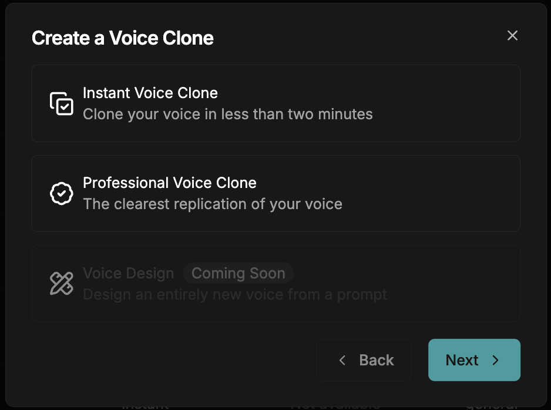
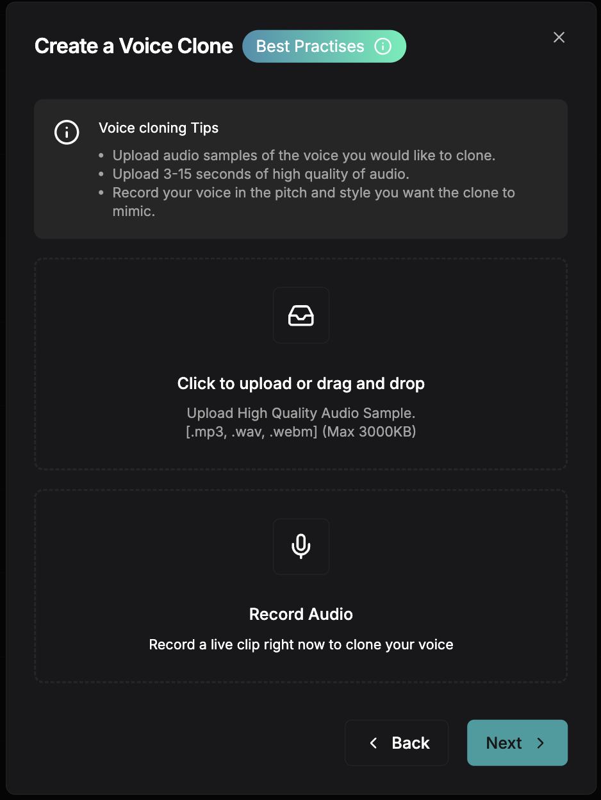
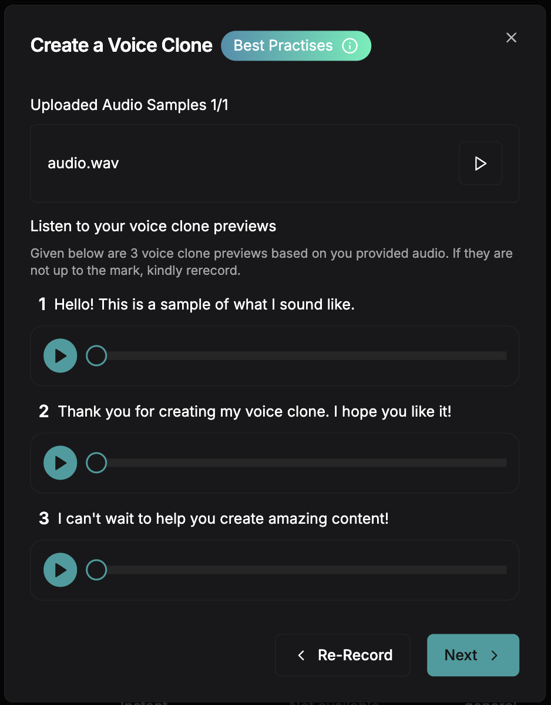
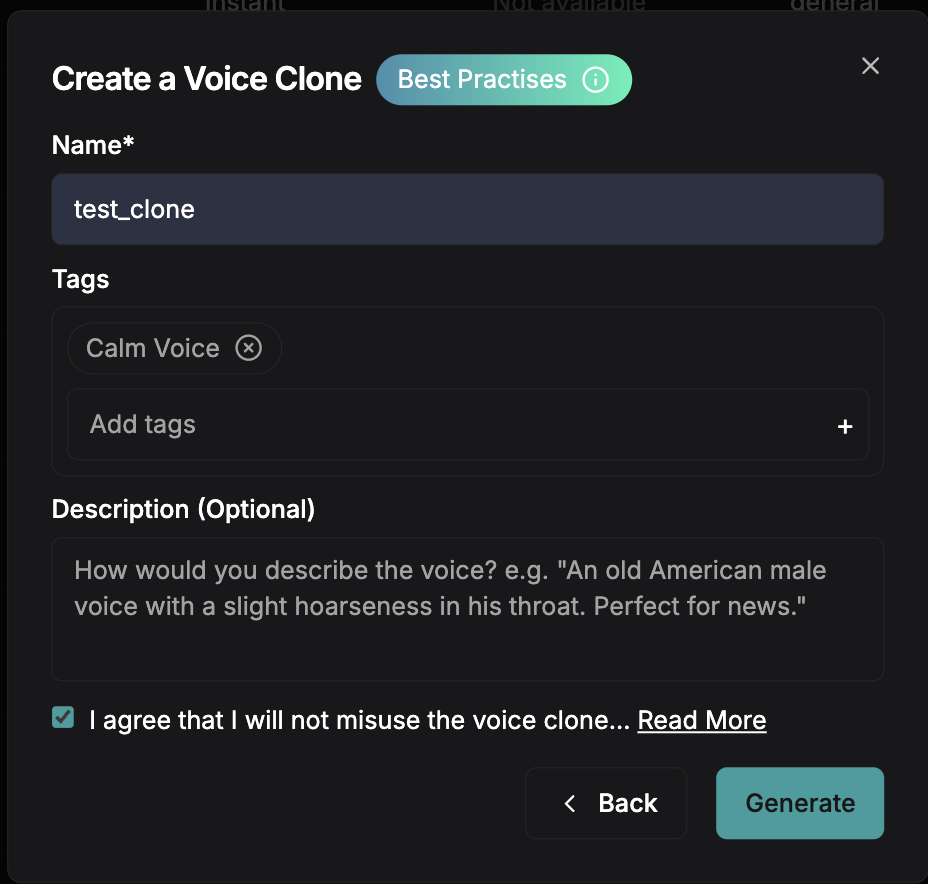

Clone any voice from just 5-15 seconds of audio. Upload a sample, get a voice ID, and use it in your TTS calls immediately.

<Note>
**Professional voice cloning** (45+ minutes of studio audio, higher fidelity) is available on demand. Contact [support@smallest.ai](mailto:support@smallest.ai) or reach out on [Discord](https://discord.gg/5evETqguJs).
</Note>

# Creating an Instant Voice Clone  

 1️. **Go to the Smallest AI Platform**  
   - Navigate to the **[platform](https://app.smallest.ai/waves/voice-cloning?utm_source=documentation&utm_medium=voice-cloning)** and click on **Create New**.  
   - In the modal that appears, select **Instant Voice Clone**.  

   

 2️. **Upload Your Clean Reference Audio**  
   - Select a **short, high-quality** audio clip (5-15 seconds).  
   - Ensure the recording is **clear and noise-free** for the best results.  
   - Follow the recommended **[best practices](/v3.0.1/content/best-practices/vc-best-practices)** to maximize quality.  

   

 3️. **Review Generated Testing Examples**  
   - The platform will process your reference audio and generate **sample outputs**.  
   - Listen to the test clips to verify the voice match.  

   

 4️. **Customize & Save Your Voice Clone**  
   - Fill in details like **Name, Tags, and Description** for your voice.  
   - Click **Generate** to store your cloned voice.  

   

**Next:** Use your cloned voice in TTS calls by passing the voice ID as `voice_id` — or clone via the [Python SDK](/waves/documentation/voice-cloning/how-to-vc) for programmatic workflows.

Need help? Ask on [Discord](https://discord.gg/5evETqguJs) or email [support@smallest.ai](mailto:support@smallest.ai).
