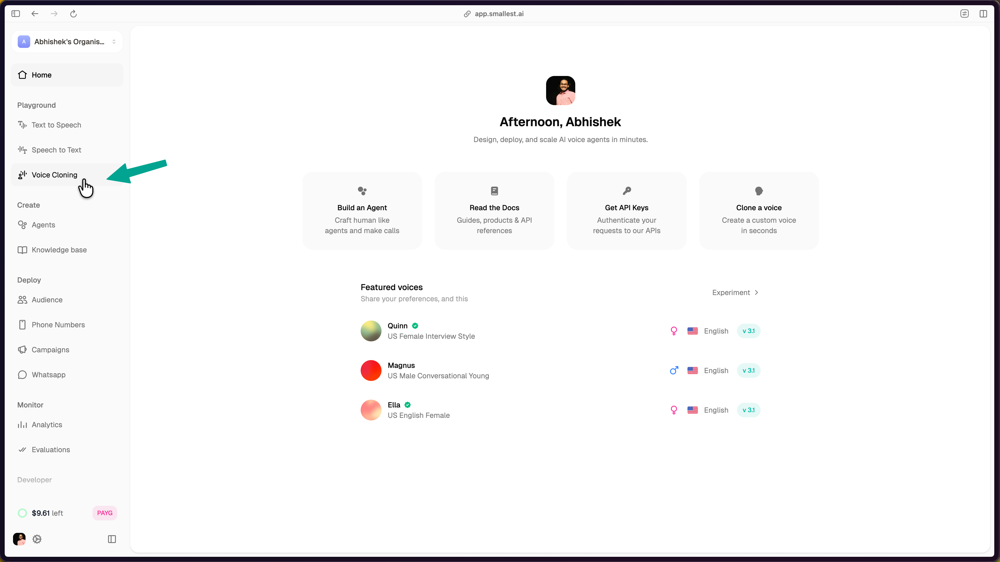
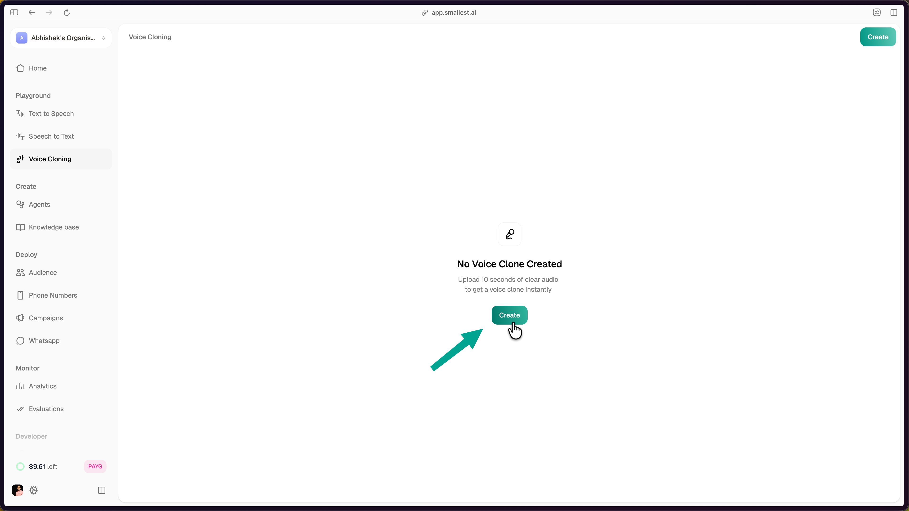
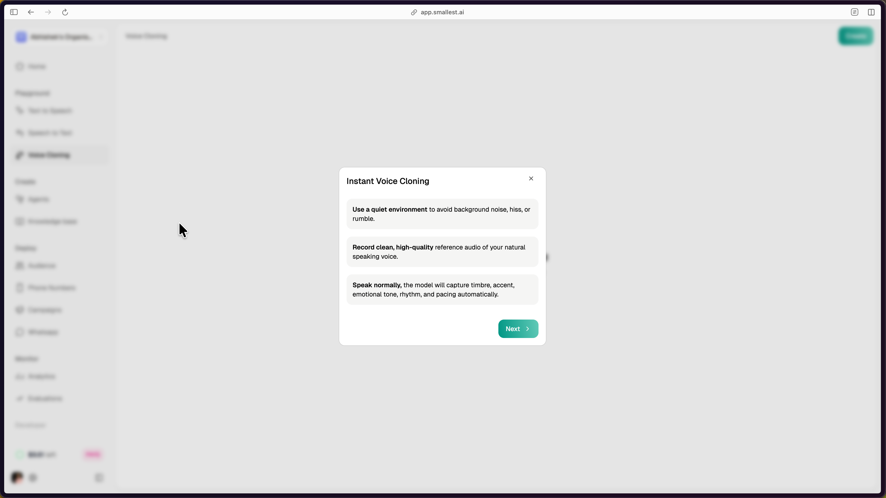
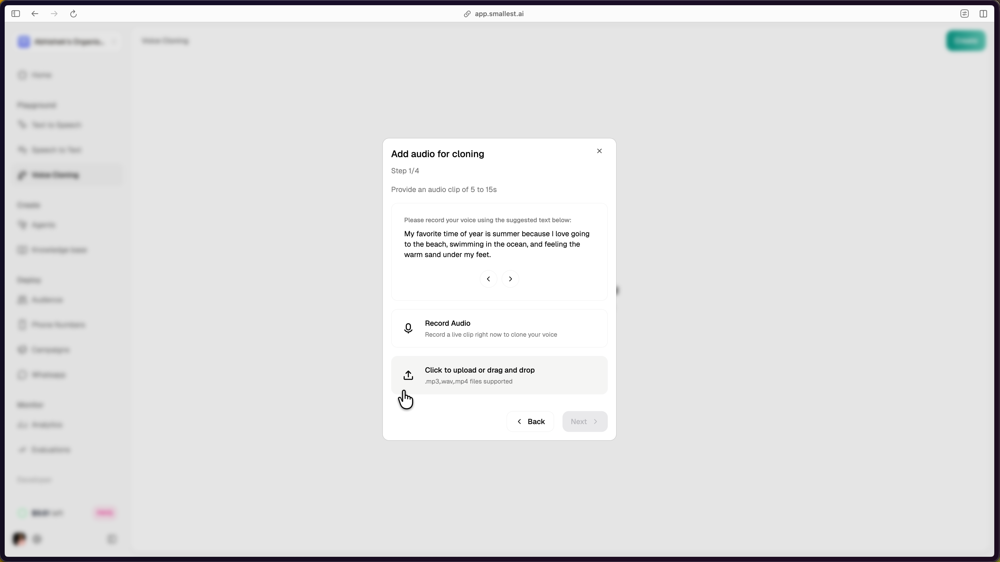
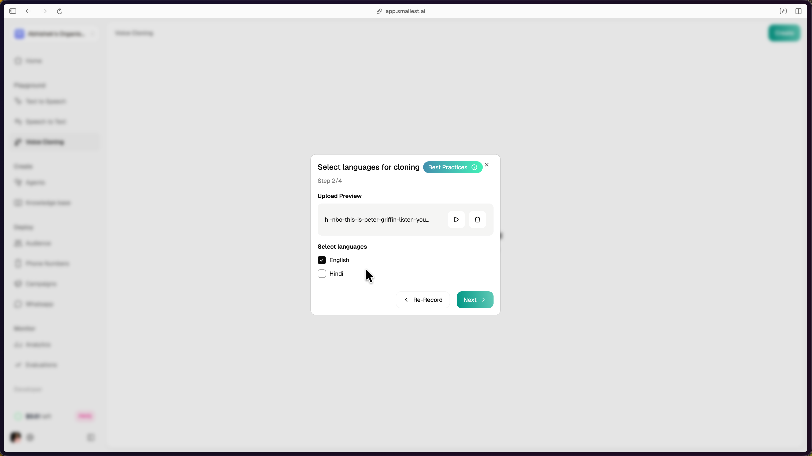
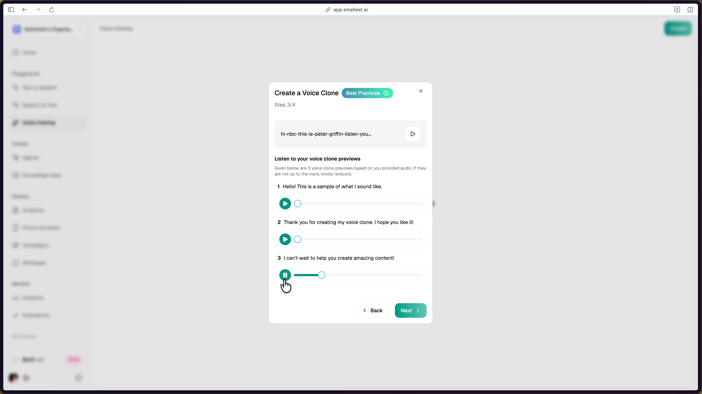
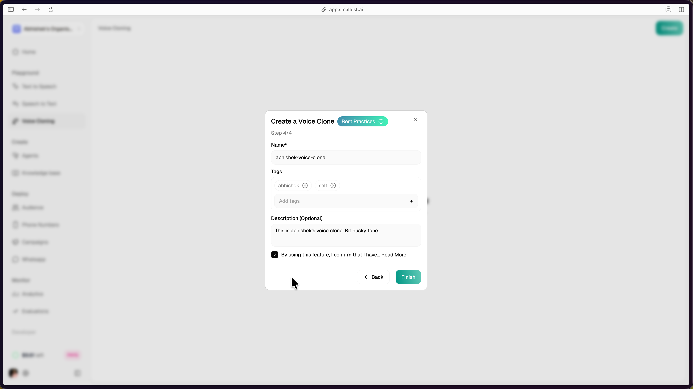
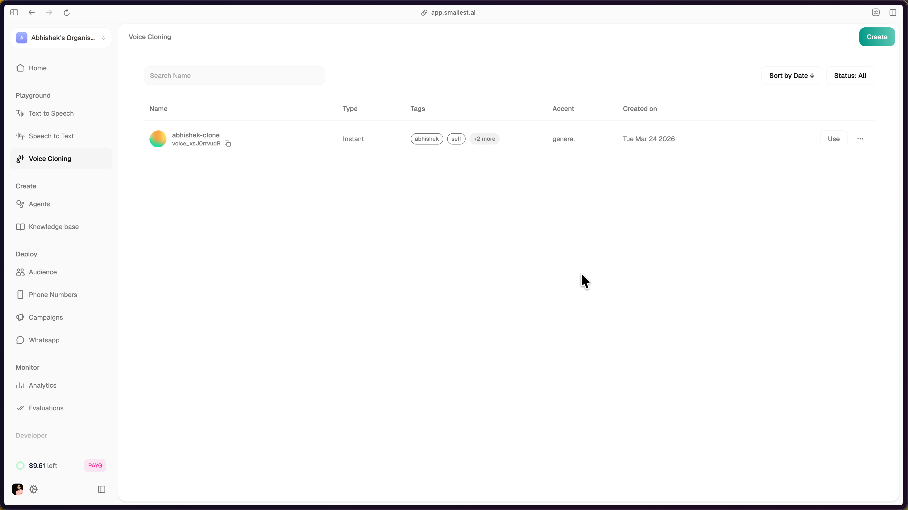
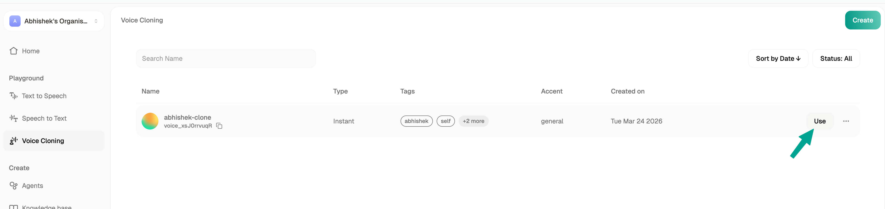
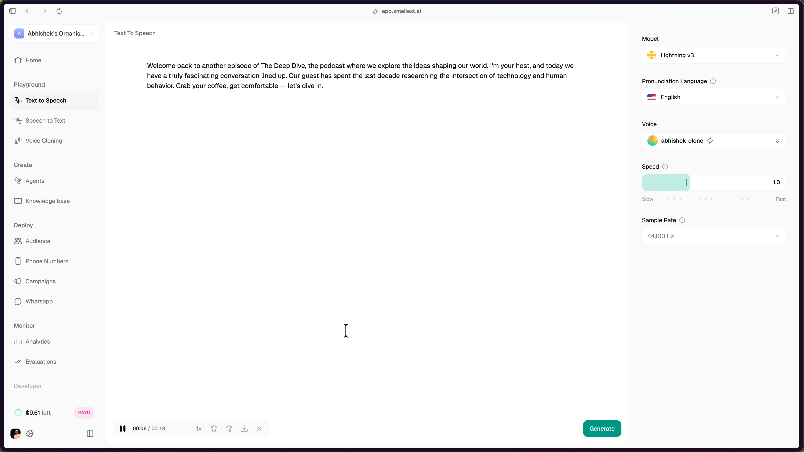

Clone any voice from 5-15 seconds of reference audio using the web console. No code required. Upload a sample, preview the clone, and get a `voice_id` to use in your TTS API calls immediately.

## Prerequisites

- A [Smallest AI account](https://app.smallest.ai)
- A clean audio recording (5-15 seconds, `.mp3`, `.wav`, or `.mp4`)

For recording guidelines, see [Voice Cloning Best Practices](/waves/documentation/best-practices/vc-best-practices).

---

## Step 1: Navigate to Voice Cloning

Log in to [app.smallest.ai](https://app.smallest.ai/dashboard) and select **Voice Cloning** from the left sidebar under **Playground**.



## Step 2: Start a New Clone

Click the **Create** button. If this is your first clone, the button is displayed in the center of the page. Otherwise, use the **Create** button in the top-right corner.



A guide dialog appears with best practices for reference audio:

- **Use a quiet environment** to avoid background noise, hiss, or rumble.
- **Record clean, high-quality** reference audio of your natural speaking voice.
- **Speak normally.** The model captures timbre, accent, emotional tone, rhythm, and pacing automatically.



Click **Next** to proceed.

## Step 3: Provide Reference Audio

Provide an audio clip of 5 to 15 seconds. Two options are available:

1. **Record Audio** — Record a live clip directly in the browser. Allow microphone access when prompted.
2. **Upload or drag and drop** — Upload a pre-recorded file. Supported formats: `.mp3`, `.wav`, `.mp4`.

The console provides a suggested text prompt to read aloud if you choose to record live.



## Step 4: Preview and Select Language

After uploading or recording, preview your audio using the playback controls. Select the target language(s) for the clone. English is selected by default; Hindi is also available.

For best results, record reference audio in the same language as your intended output. See [Voice Cloning Best Practices](/waves/documentation/best-practices/vc-best-practices) for multi-lingual cloning guidance.



Click **Next** to proceed.

## Step 5: Listen to Clone Previews

The platform generates sample audio clips using your cloned voice. Listen to the previews to verify the voice matches your expectations. If the quality is not satisfactory, click **Back** to re-record or upload different reference audio.



Click **Next** to proceed.

## Step 6: Name and Save

Provide a **Name**, **Tags**, and optional **Description** for the cloned voice. Accept the terms and conditions, then click **Finish** to save.



---

## Using Your Cloned Voice

After saving, the cloned voice appears in your Voice Cloning dashboard with its `voice_id`, type, tags, accent, and creation date.



Click the **Use** button next to your clone to open the Text to Speech playground with your cloned voice pre-selected.



The TTS playground opens with your cloned voice selected under **Voice**, the model set to **Lightning v3.1**, and controls for pronunciation language, speed, and sample rate. Enter text and click **Generate** to synthesize speech with your cloned voice.



---

## Using the Clone via API

Pass the `voice_id` from your dashboard in any TTS API call:

```bash
curl -X POST "https://api.smallest.ai/waves/v1/lightning-v3.1/get_speech" \
  -H "Authorization: Bearer $SMALLEST_API_KEY" \
  -H "Content-Type: application/json" \
  -d '{
    "text": "Hello, this is my cloned voice.",
    "voice_id": "voice_xsJ0rrvuqR"
  }' \
  -o output.pcm
```

For programmatic voice cloning (create clones via code), see [Voice Cloning via API](/waves/documentation/voice-cloning/instant-clone-sdk).

Need help? Contact [support@smallest.ai](mailto:support@smallest.ai) or ask on [Discord](https://discord.gg/9WtSXv26WE).
